## OC语法
### 面向对象

- 一个NSObject对象占用多少内存？

```
系统分配了16个字节给NSObject对象（通过malloc_size函数获得）
但NSObject对象内部只使用了8个字节的空间（64bit环境下，可以通过class_getInstanceSize函数获得）
```


- 对象的isa指针指向哪里？

```
instance对象的isa指向class对象
class对象的isa指向meta-class对象
meta-class对象的isa指向基类的meta-class对象

备注: 从64bit开始，isa需要进行一次位运算(& ISA_MASK)，才能计算出真实地址
```


- OC的类信息存放在哪里？

```
OC对象主要分为3种:
- instance对象, 存放成员变量的具体值
- class对象, 存放对象方法、属性、成员变量、协议信息
- meta-class对象, 存放类方法

meta-class对象和class对象的内存结构是一样的, 都是struct objc_class
```

#### KVO

KVO的全称是Key-Value Observing，俗称“键值监听”，可以用于监听某个对象属性值的改变


- iOS用什么方式实现对一个对象的KVO？(KVO的本质是什么？)

```
1.利用RuntimeAPI动态生成一个子类
2.让instance对象的isa指向这个全新的子类
3.当修改instance对象的属性时，会调用Foundation的_NSSetXXXValueAndNotify函数

_NSSetXXXValueAndNotify内部实现:
- willChangeValueForKey:
- 父类原来的setter
- didChangeValueForKey: 内部会触发监听器（Oberser）的监听方法(observeValueForKeyPath:ofObject:change:context:）
```

- 如何手动触发KVO？

```
手动调用willChangeValueForKey:和didChangeValueForKey:
```

- 直接修改成员变量会触发KVO么？

```
不会触发KVO
```

#### KVC
KVC的全称是Key-Value Coding，俗称“键值编码”，可以通过一个key来访问某个属性

- KVC的赋值和取值过程是怎样的？原理是什么？

```
见下图...
accessInstanceVariablesDirectly方法的默认返回值是YES
```

- setValue:forKey:的原理
	


- valueForKey:的原理


- 通过KVC修改属性会触发KVO么？

```
会触发KVO
```


#### Category

- Category的使用场合是什么？

```
分类是用于给原有类添加方法的, 它只能添加方法, 在Category中不能直接添加成员变量
分类中的@property, 只会生成setter/getter方法的声明, 不会生成实现以及私有的成员变量
```

- Category的实现原理?

```
Category编译之后的底层结构是struct category_t，里面存储着分类的对象方法、类方法、属性、协议信息
在程序运行的时候，runtime会将Category的数据，合并到类信息中（类对象、元类对象中）
```


- Category的加载处理过程

```
1. 通过Runtime加载某个类的所有Category数据
2. 把所有Category的方法、属性、协议数据，合并到一个大数组中
	- 后面参与编译的Category数据，会在数组的前面
3. 将合并后的分类数据（方法、属性、协议），插入到类原来数据的前面

```

- Category和Class Extension的区别是什么？

```
Class Extension在编译的时候，它的数据就已经包含在类信息中
Category是在运行时，才会将数据合并到类信息中
```

#### 关联对象

- Category能否添加成员变量？如果可以，如何给Category添加成员变量？

```
默认情况下，因为分类底层结构的限制，不能添加成员变量到分类中。
但可以通过关联对象来间接实现

关联对象提供了以下API:
- 添加关联对象
void objc_setAssociatedObject(id object, const void * key,
                                id value, objc_AssociationPolicy policy)
- 获得关联对象
id objc_getAssociatedObject(id object, const void * key)
- 移除所有的关联对象
void objc_removeAssociatedObjects(id object)

```

- objc_AssociationPolicy


- 关联对象的原理

```
实现关联对象技术的核心对象有:
AssociationsManager
AssociationsHashMap
ObjectAssociationMap
ObjcAssociation
```


#### +Load方法 和 +initialize方法

- +Load方法

```
+load方法会在runtime加载类、分类时调用
每个类、分类的+load，在程序运行过程中只调用一次

调用顺序:
- 先调用类的+load
	- 按照编译先后顺序调用（先编译，先调用）
	- 调用子类的+load之前会先调用父类的+load
- 再调用分类的+load
	- 按照编译先后顺序调用（先编译，先调用）
```


- +initialize方法

```
+initialize方法会在类第一次接收到消息时调用

调用顺序
- 先调用父类的+initialize，再调用子类的+initialize
- (先初始化父类，再初始化子类，每个类只会初始化1次)
```


- load、initialize方法的区别什么？

```
+initialize和+load的很大区别是，+initialize是通过objc_msgSend进行调用的，所以有以下特点

如果子类没有实现+initialize，会调用父类的+initialize（所以父类的+initialize可能会被调用多次）
如果分类实现了+initialize，就覆盖类本身的+initialize调用
```

- `总结`: load、initialize方法的区别什么？它们在category中的调用的顺序？以及出现继承时他们之间的调用过程？

```
1.调用方式
1> load是根据函数地址直接调用
2> initialize是通过objc_msgSend调用

2.调用时刻
1> load是runtime加载类、分类的时候调用（只会调用1次）
2> initialize是类第一次接收到消息的时候调用，每一个类只会initialize一次（父类的initialize方法可能会被调用多次）

load、initialize的调用顺序？
1.load
1> 先调用类的load
a) 先编译的类，优先调用load
b) 调用子类的load之前，会先调用父类的load

2> 再调用分类的load
a) 先编译的分类，优先调用load

2.initialize
1> 先初始化父类
2> 再初始化子类（可能最终调用的是父类的initialize方法）
```


### Block

##### block原理

- OC代码


- 底层实现


- 底层结构


##### block变量捕获

为了保证block内部能够正常访问外部的变量，block有个变量捕获机制


##### block类型

block有3种类型，可以通过调用class方法或者isa指针查看具体类型，最终都是继承自`NSBlock`类型

- \__NSGlobalBlock__ （ _NSConcreteGlobalBlock ）
- \__NSStackBlock__ （ _NSConcreteStackBlock ）
- \__NSMallocBlock__ （ _NSConcreteMallocBlock ）


每一种类型的block调用copy后的结果如下所示:


##### block的copy

```objc
在ARC环境下，编译器会根据情况自动将栈上的block复制(copy)到堆上，比如以下情况
- block作为函数返回值时
- 将block赋值给__strong指针时
- block作为Cocoa API中方法名含有usingBlock的方法参数时
- block作为GCD API的方法参数时

MRC下block属性的建议写法, 将栈上的block复制(copy)到堆上
@property (copy, nonatomic) void (^block)(void);

ARC下block属性的建议写法
@property (strong, nonatomic) void (^block)(void);
@property (copy, nonatomic) void (^block)(void);

```

##### 对象类型的auto变量

```objc
当block内部访问了"对象类型"的auto变量时
如果block是在栈上，将不会对auto变量产生强引用

如果block被拷贝到堆上
会调用block内部的copy函数
copy函数内部会调用_Block_object_assign函数
_Block_object_assign函数会根据auto变量的修饰符（__strong、__weak、__unsafe_unretained）做出相应的操作，形成强引用（retain）或者弱引用

如果block从堆上移除
会调用block内部的dispose函数
dispose函数内部会调用_Block_object_dispose函数
_Block_object_dispose函数会自动释放引用的auto变量（release）

```


##### __block修饰符

```
__block可以用于解决block内部无法修改auto变量值的问题
__block不能修饰全局变量、静态变量（static）
```

- 编译器会将__block变量包装成一个对象


- __block的内存管理
	- 当block在栈上时，并不会对__block变量产生强引用
	- 当block被copy到堆时
		- 会调用block内部的copy函数
		- copy函数内部会调用\_Block\_object\_assign函数
		- \_Block\_object\_assign函数会对__block变量形成强引用（retain）

	
	
	- 当block从堆中移除时
		- 会调用block内部的dispose函数
dispose函数内部会调用\_Block\_object\_dispose函数
\_Block\_object\_dispose函数会自动释放引用的__block变量（release）
		
		

- ____block的__forwarding指针
	
	

- 对象类型的auto变量、__block变量

```c
当block在栈上时，对它们都不会产生强引用

当block拷贝到堆上时，都会通过copy函数来处理它们
- __block变量（假设变量名叫做a）
	_Block_object_assign((void*)&dst->a, (void*)src->a, 8/*BLOCK_FIELD_IS_BYREF*/);

- 对象类型的auto变量（假设变量名叫做p）
	_Block_object_assign((void*)&dst->p, (void*)src->p, 3/*BLOCK_FIELD_IS_OBJECT*/);

当block从堆上移除时，都会通过dispose函数来释放它们
- __block变量（假设变量名叫做a）
	_Block_object_dispose((void*)src->a, 8/*BLOCK_FIELD_IS_BYREF*/);

- 对象类型的auto变量（假设变量名叫做p）
	_Block_object_dispose((void*)src->p, 3/*BLOCK_FIELD_IS_OBJECT*/);
```

- 被__block修饰的对象类型

```c
当__block变量在栈上时，不会对指向的对象产生强引用

当__block变量被copy到堆时, 会调用__block变量内部的copy函数
copy函数内部会调用_Block_object_assign函数
_Block_object_assign函数会根据所指向对象的修饰符（__strong、__weak、__unsafe_unretained）做出相应的操作，形成强引用（retain）或者弱引用
（注意：这里仅限于ARC时会retain，MRC时不会retain）

如果__block变量从堆上移除, 会调用__block变量内部的dispose函数
dispose函数内部会调用_Block_object_dispose函数
_Block_object_dispose函数会自动释放指向的对象（release）
```

##### 循环引用

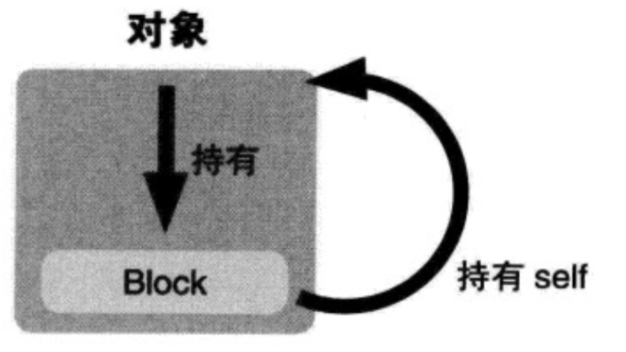

- 解决循环引用问题 - ARC

#### block相关问题

- block的原理是怎样的？本质是什么？

```
封装了函数调用以及调用环境的OC对象

本质: OC对象, 继承自NSBlock
```

- __block的作用是什么？有什么使用注意点？

```
1. __block可以用于block内部修改auto变量值的问题
2. MRC下可以使用__block解决循环引用

__block本质是, 将所修饰的变量包装成一个对象
该对象中有一个成员变量存储着该变量的值
```

- block的属性修饰词为什么是copy？使用block有哪些使用注意？

```
ARC下修饰词使用strong或者copy都可以
MRC下面使用copy将block拷贝到堆上
block一旦没有进行copy操作，就不会在堆上

循环引用问题:
当block被copy到堆中时, 会对block中使用到__strong修饰的对象类型的auto变量进行强引用
如果当前对象也强引用着该block, 会造成循环应用

解决循环引用:
使用__weak或者__unsafe_unretained修饰该对象类型的auto变量

__weak：不会产生强引用，指向的对象销毁时，会自动让指针置为nil
__unsafe_unretained：不会产生强引用，不安全，指向的对象销毁时，指针存储的地址值不变
```

- block在修改NSMutableArray，需不需要添加__block？

```
不需要
```

### Runtime

- Objective-C是一门动态性比较强的编程语言，跟C、C++等语言有着很大的不同
- Objective-C的动态性是由Runtime API来支撑的
- Runtime API提供的接口基本都是C语言的，源码由C\C++\汇编语言编写

##### isa

- 在arm64架构之前，isa就是一个普通的指针，存储着Class、Meta-Class对象的内存地址
- 从arm64架构开始，对isa进行了优化，变成了一个共用体（union）结构，还使用位域来存储更多的信息
	
	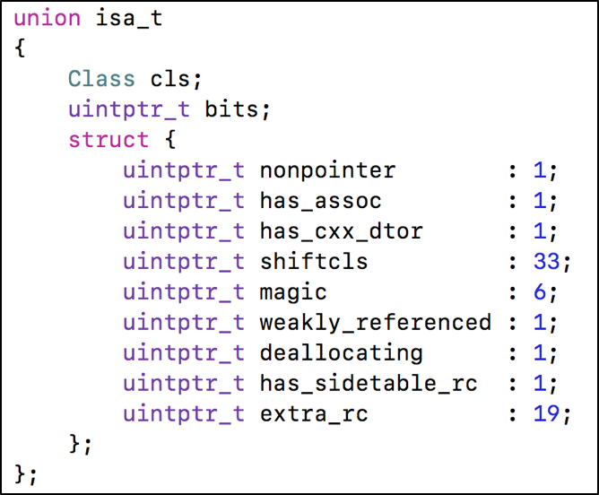

	```
	nonpointer
	0，代表普通的指针，存储着Class、Meta-Class对象的内存地址
	1，代表优化过，使用位域存储更多的信息
	
	has_assoc
	是否有设置过关联对象，如果没有，释放时会更快
	
	has_cxx_dtor
	是否有C++的析构函数（.cxx_destruct），如果没有，释放时会更快
	
	shiftcls
	存储着Class、Meta-Class对象的内存地址信息
	
	magic
	用于在调试时分辨对象是否未完成初始化
	
	deallocating
	对象是否正在释放
	
	extra_rc
	里面存储的值是引用计数器减1
	
	has_sidetable_rc
	引用计数器是否过大无法存储在isa中
	如果为1，那么引用计数会存储在一个叫SideTable的类的属性中
```

#### Class的结构


- class\_rw\_t
	- class\_rw\_t里面的methods、properties、protocols是二维数组，是可读可写的，包含了类的初始内容、分类的内容

	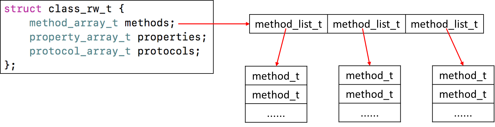

- class\_ro\_t
	- class\_ro\_t里面的baseMethodList、baseProtocols、ivars、baseProperties是一维数组，是只读的，包含了类的初始内容
 
	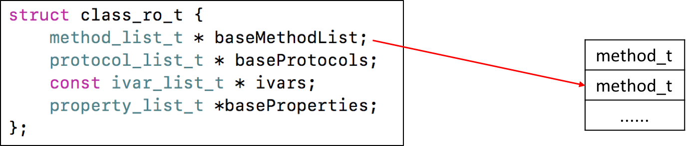

- method_t: 对方法\函数的封装

	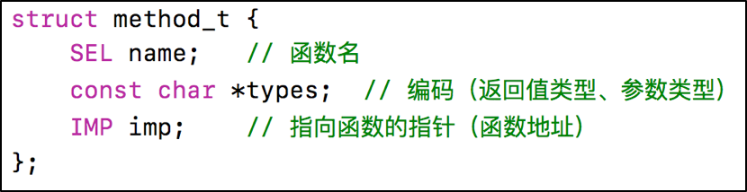

	- IMP代表函数的具体实现
	- SEL代表方法\函数名，一般叫做选择器，底层结构跟char *类似
		- 可以通过@selector()和sel_registerName()获得
		- 可以通过sel_getName()和NSStringFromSelector()转成字符串
		- 不同类中相同名字的方法，所对应的方法选择器是相同的
	- types包含了函数返回值、参数编码的字符串

##### 方法缓存

Class内部结构中有个方法缓存（`cache_t`），用`散列表（哈希表）`来缓存曾经调用过的方法，可以提高方法的查找速度

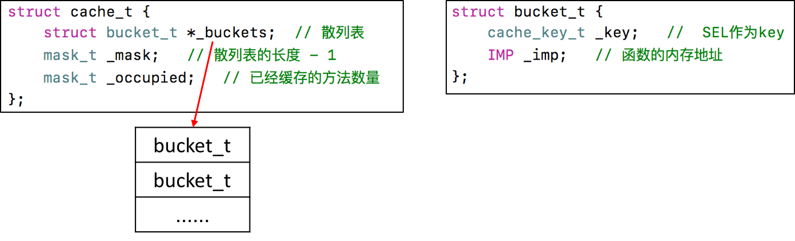


##### objc_msgSend执行流程

OC中的方法调用，其实都是转换为objc_msgSend函数的调用, objc_msgSend的执行流程可以分为3大阶段

- 消息发送


```
如果是从class_rw_t中查找方法
- 已经排序的，二分查找
- 没有排序的，遍历查找

receiver通过isa指针找到receiverClass
receiverClass通过superclass指针找到superClass
```

- 动态方法解析

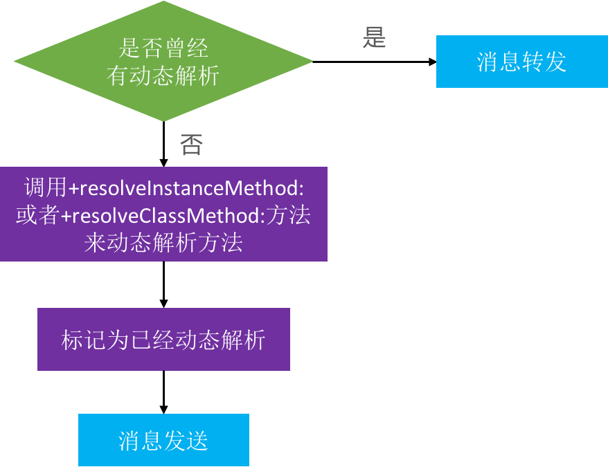

```
开发者可以实现以下方法，来动态添加方法实现
+resolveInstanceMethod:
+resolveClassMethod:

动态解析过后，会重新走“消息发送”的流程
“从receiverClass的cache中查找方法”这一步开始执行
```

动态添加方法
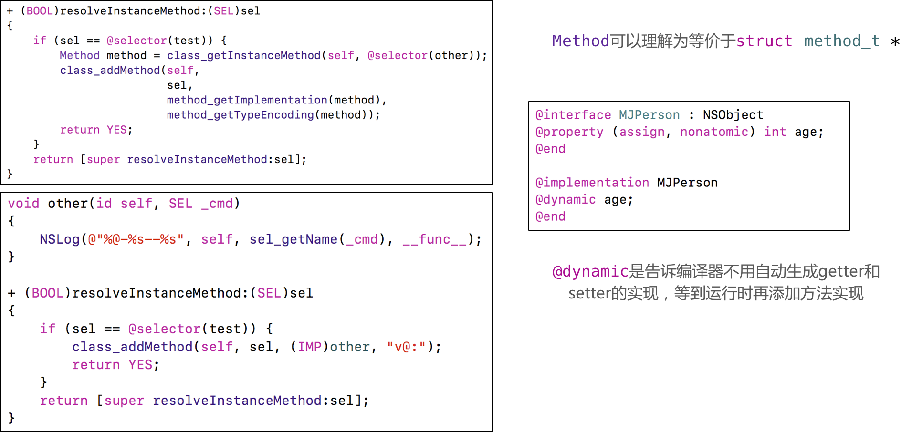

- 消息转发

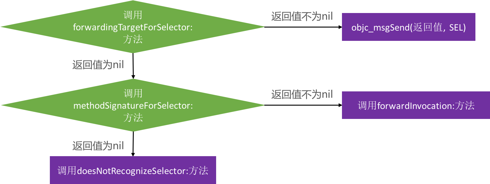

```
开发者可以在forwardInvocation:方法中自定义任何逻辑
以上方法都有对象方法、类方法2个版本（前面可以是加号+，也可以是减号-）
```

#### Runtime相关问题

- 讲一下 OC 的消息机制

```
OC中的方法调用其实都是转成了objc_msgSend函数的调用，给receiver（方法调用者）发送了一条消息（selector方法名）
objc_msgSend底层有3大阶段:
消息发送（当前类、父类中查找）、动态方法解析、消息转发
```

- 消息转发机制流程

```
消息发送阶段:
1. 消息接收者是否为nil? 
2. 不为nil, 从方法缓存中查找.
3. 缓存中没有, 去方法列表中查找, 如果找到就调用该方法, 并且将该方法缓存中
4. 当前类方法列表中找不到, 通过superclass指针, 去父类的方法列表中查找, 如果找到就调用该方法, 并且将该方法存在缓存中

动态方法解析
5. 如果通过superclass都没有找到, 判断是否做过动态解析
6. 如果没有会调用+resolveInstanceMethod:或+resolveClassMethod:来动态解析方法(在该方法中可以动态添加方法), 并标记为做过动态解析, 从新走一遍消息发送流程

消息转发
7. 如果已经做过动态解析, 则进入消息转发
- 调用forwardingTargetForSelector:方法, 通过返回值转发给其他对象, 进行消息发送
- 如果返回值为nil, 调用methodSignatureForSelector:方法, 返回值为nil, 调用doesNotRecognizeSelector:方法
- 返回值不为nil, 调用调用forwardInvocation:方法
```

- 什么是Runtime？平时项目中有用过么？

```
OC是一门动态性比较强的编程语言，允许很多操作推迟到程序运行时再进行
OC的动态性就是由Runtime来支撑和实现的，Runtime是一套C语言的API，封装了很多动态性相关的函数
平时编写的OC代码，底层都是转换成了Runtime API进行调用

具体应用:
利用关联对象（AssociatedObject）给分类添加属性
遍历类的所有成员变量（修改textfield的占位文字颜色、字典转模型、自动归档解档）
交换方法实现（交换系统的方法）
利用消息转发机制解决方法找不到的异常问题
```

### RunLoop

- 运行循环, 在程序运行过程中循环做一些事情

```
RunLoop的基本作用:
- 保持程序的持续运行
- 处理App中的各种事件（比如触摸事件、定时器事件等）
- 节省CPU资源，提高程序性能：该做事时做事，该休息时休息
```

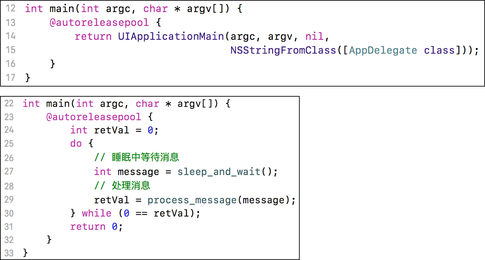

- iOS中有2套API来访问和使用RunLoop
	- Foundation：NSRunLoop (NSRunLoop是基于CFRunLoopRef的一层OC包装
)
	- Core Foundation：CFRunLoopRef

- RunLoop与线程

```
每条线程都有唯一的一个与之对应的RunLoop对象
RunLoop保存在一个全局的Dictionary里，线程作为key，RunLoop作为value
线程刚创建时并没有RunLoop对象，RunLoop会在第一次获取它时创建
RunLoop会在线程结束时销毁
主线程的RunLoop已经自动获取（创建），子线程默认没有开启RunLoop
```

##### Mode

- RunLoop相关的类

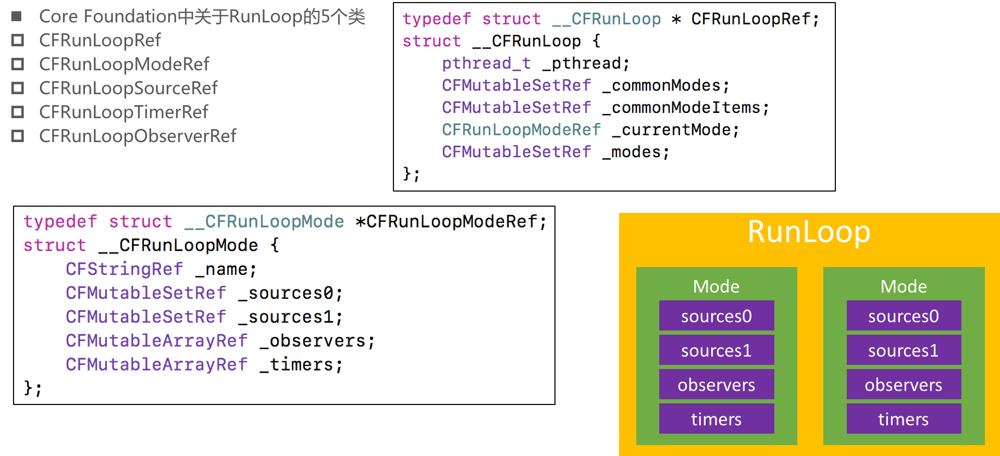

- CFRunLoopModeRef

```
CFRunLoopModeRef代表RunLoop的运行模式

一个RunLoop包含若干个Mode，每个Mode又包含若干个Source0/Source1/Timer/Observer

RunLoop启动时只能选择其中一个Mode，作为currentMode

如果需要切换Mode，只能退出当前Loop，再重新选择一个Mode进入
不同组的Source0/Source1/Timer/Observer能分隔开来，互不影响

如果Mode里没有任何Source0/Source1/Timer/Observer，RunLoop会立马退出
```

```
常见的2种Mode:
kCFRunLoopDefaultMode（NSDefaultRunLoopMode）：App的默认Mode，通常主线程是在这个Mode下运行
UITrackingRunLoopMode：界面跟踪 Mode，用于 ScrollView 追踪触摸滑动，保证界面滑动时不受其他 Mode 影响
```

- CFRunLoopObserverRef

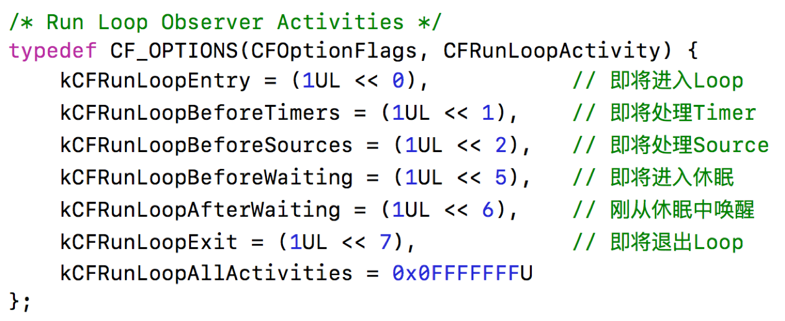

- 添加Observer监听RunLoop的所有状态

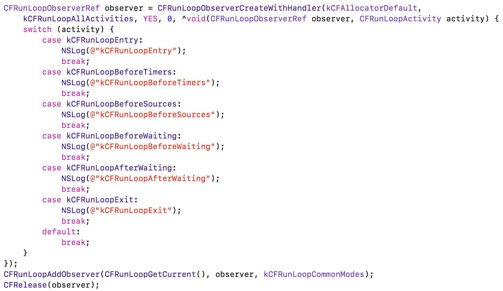

#### RunLoop的运行逻辑

```
Source0
触摸事件处理
performSelector:onThread:

Source1
基于Port的线程间通信(如: 其他线程发过来的消息)
系统事件捕捉(捕捉到系统事件后, 包装成source0进行处理)

Timers
NSTimer
performSelector:withObject:afterDelay:

Observers
用于监听RunLoop的状态
UI刷新（BeforeWaiting）
Autorelease pool（BeforeWaiting）
```

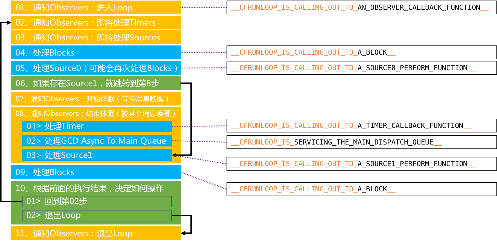

#### RunLoop相关问题

- 讲讲 RunLoop，项目中有用到吗？

```
```

- runloop内部实现逻辑？

```
do {
	
}
while 循环
```

- runloop和线程的关系？

```
每条线程都有唯一的一个与之对应的RunLoop对象
RunLoop保存在一个全局的Dictionary里，线程作为key，RunLoop作为value
线程刚创建时并没有RunLoop对象，RunLoop会在第一次获取它时创建
RunLoop会在线程结束时销毁
主线程的RunLoop已经自动获取（创建），子线程默认没有开启RunLoop
```

- timer 与 runloop 的关系？

```
```

- 程序中添加每3秒响应一次的NSTimer，当拖动tableview时timer可能无法响应要怎么解决？

```
```

- runloop 是怎么响应用户操作的，具体流程是什么样的？

```
```

- 说说runLoop的几种状态

```
```

- runloop的mode作用是什么？

```
分隔不同模式下的Source0/Source1/Timer/Observer，互不影响
```

### 多线程

- 多线程方案

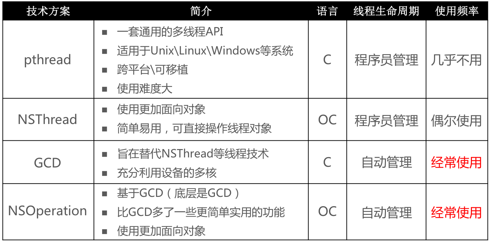

##### GCD

- 队列组

```
思考：如何用gcd实现以下功能
异步并发执行任务1、任务2
等任务1、任务2都执行完毕后，再回到主线程执行任务3
```

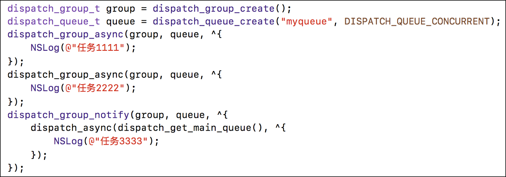

#### 多线程相关问题

```
你理解的多线程？

iOS的多线程方案有哪几种？你更倾向于哪一种？

你在项目中用过 GCD 吗？

GCD 的队列类型

说一下 OperationQueue 和 GCD 的区别，以及各自的优势

线程安全的处理手段有哪些？

OC你了解的锁有哪些？在你回答基础上进行二次提问；
追问一：自旋和互斥对比？
追问二：使用以上锁需要注意哪些？
追问三：用C/OC/C++，任选其一，实现自旋或互斥？口述即可！
```