## OC语法
#### 面向对象

- 一个NSObject对象占用多少内存？

```
系统分配了16个字节给NSObject对象（通过malloc_size函数获得）
但NSObject对象内部只使用了8个字节的空间（64bit环境下，可以通过class_getInstanceSize函数获得）
```

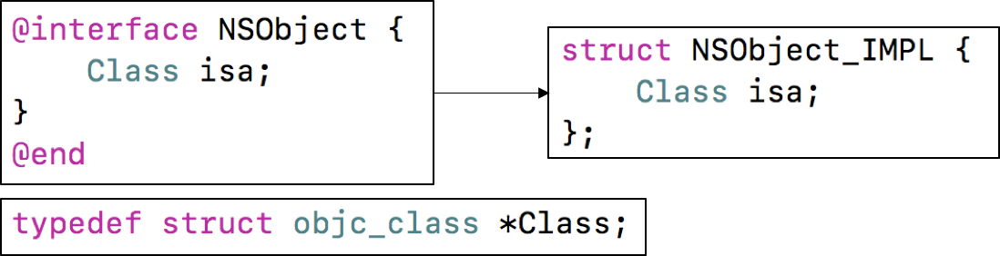

- 对象的isa指针指向哪里？

```
instance对象的isa指向class对象
class对象的isa指向meta-class对象
meta-class对象的isa指向基类的meta-class对象

备注: 从64bit开始，isa需要进行一次位运算(& ISA_MASK)，才能计算出真实地址
```


- OC的类信息存放在哪里？

```
OC对象主要分为3种:
- instance对象, 存放成员变量的具体值
- class对象, 存放对象方法、属性、成员变量、协议信息
- meta-class对象, 存放类方法

meta-class对象和class对象的内存结构是一样的, 都是struct objc_class
```

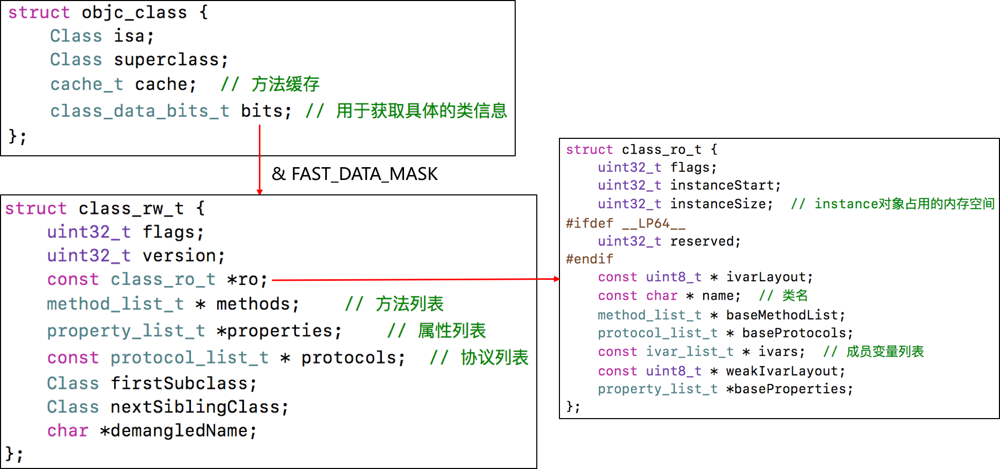


#### KVO

KVO的全称是Key-Value Observing，俗称“键值监听”，可以用于监听某个对象属性值的改变

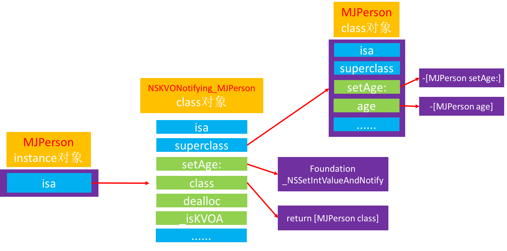

- iOS用什么方式实现对一个对象的KVO？(KVO的本质是什么？)

```
1.利用RuntimeAPI动态生成一个子类
2.让instance对象的isa指向这个全新的子类
3.当修改instance对象的属性时，会调用Foundation的_NSSetXXXValueAndNotify函数

_NSSetXXXValueAndNotify内部实现:
- willChangeValueForKey:
- 父类原来的setter
- didChangeValueForKey: 内部会触发监听器（Oberser）的监听方法(observeValueForKeyPath:ofObject:change:context:）
```

- 如何手动触发KVO？

```
手动调用willChangeValueForKey:和didChangeValueForKey:
```

- 直接修改成员变量会触发KVO么？

```
不会触发KVO
```

#### KVC
KVC的全称是Key-Value Coding，俗称“键值编码”，可以通过一个key来访问某个属性

- KVC的赋值和取值过程是怎样的？原理是什么？

```
见下图...
```

- setValue:forKey:的原理
	- accessInstanceVariablesDirectly方法的默认返回值是YES

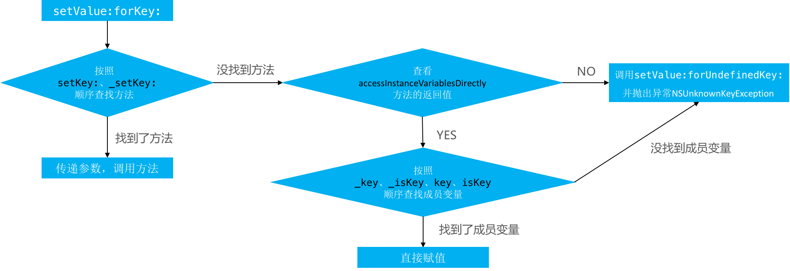

- valueForKey:的原理


- 通过KVC修改属性会触发KVO么？

```
会触发KVO
```


#### Category

- Category的使用场合是什么？

```
分类是用于给原有类添加方法的, 它只能添加方法, 在Category中不能直接添加成员变量
分类中的@property, 只会生成setter/getter方法的声明, 不会生成实现以及私有的成员变量
```

- Category的实现原理?

```
Category编译之后的底层结构是struct category_t，里面存储着分类的对象方法、类方法、属性、协议信息
在程序运行的时候，runtime会将Category的数据，合并到类信息中（类对象、元类对象中）
```

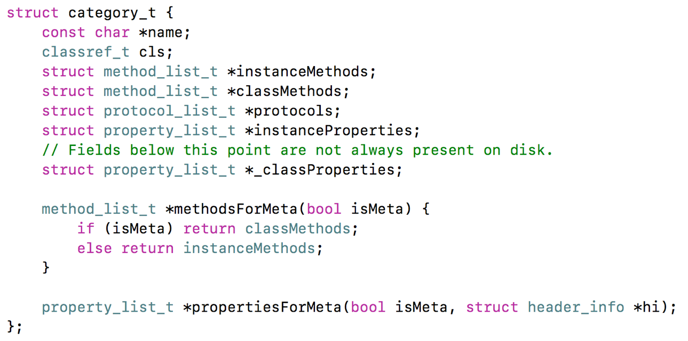

- Category的加载处理过程

```
1. 通过Runtime加载某个类的所有Category数据
2. 把所有Category的方法、属性、协议数据，合并到一个大数组中
	- 后面参与编译的Category数据，会在数组的前面
3. 将合并后的分类数据（方法、属性、协议），插入到类原来数据的前面

```

- Category和Class Extension的区别是什么？

```
Class Extension在编译的时候，它的数据就已经包含在类信息中
Category是在运行时，才会将数据合并到类信息中
```

#### 关联对象

- Category能否添加成员变量？如果可以，如何给Category添加成员变量？

```
默认情况下，因为分类底层结构的限制，不能添加成员变量到分类中。
但可以通过关联对象来间接实现

关联对象提供了以下API:
- 添加关联对象
void objc_setAssociatedObject(id object, const void * key,
                                id value, objc_AssociationPolicy policy)
- 获得关联对象
id objc_getAssociatedObject(id object, const void * key)
- 移除所有的关联对象
void objc_removeAssociatedObjects(id object)

```

- objc_AssociationPolicy

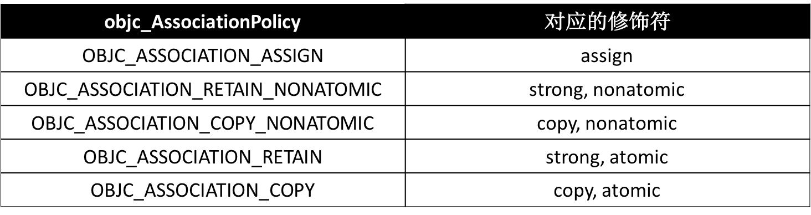

- 关联对象的原理

```
实现关联对象技术的核心对象有:
AssociationsManager
AssociationsHashMap
ObjectAssociationMap
ObjcAssociation
```

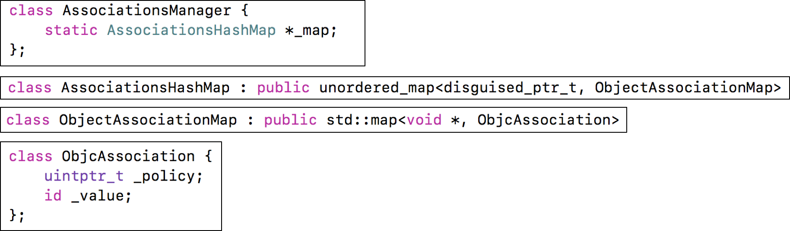

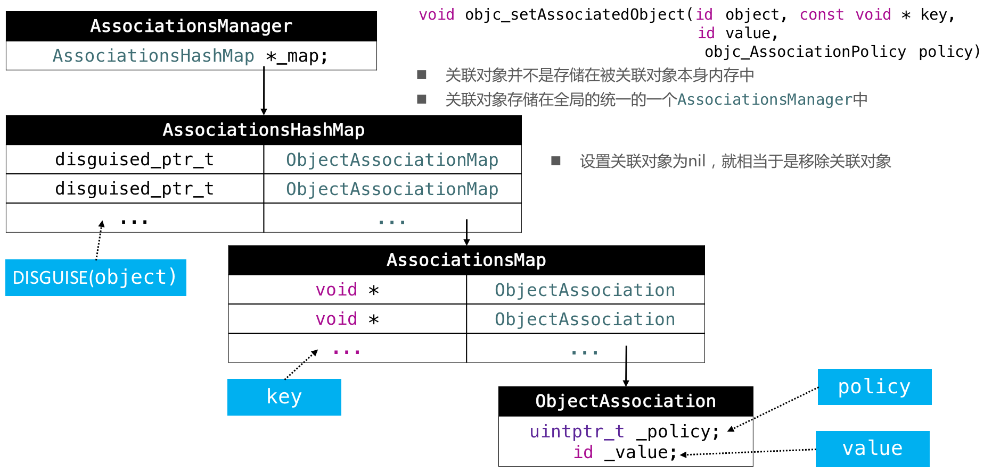

#### +Load方法 和 +initialize方法

- +Load方法

```
+load方法会在runtime加载类、分类时调用
每个类、分类的+load，在程序运行过程中只调用一次

调用顺序:
- 先调用类的+load
	- 按照编译先后顺序调用（先编译，先调用）
	- 调用子类的+load之前会先调用父类的+load
- 再调用分类的+load
	- 按照编译先后顺序调用（先编译，先调用）
```
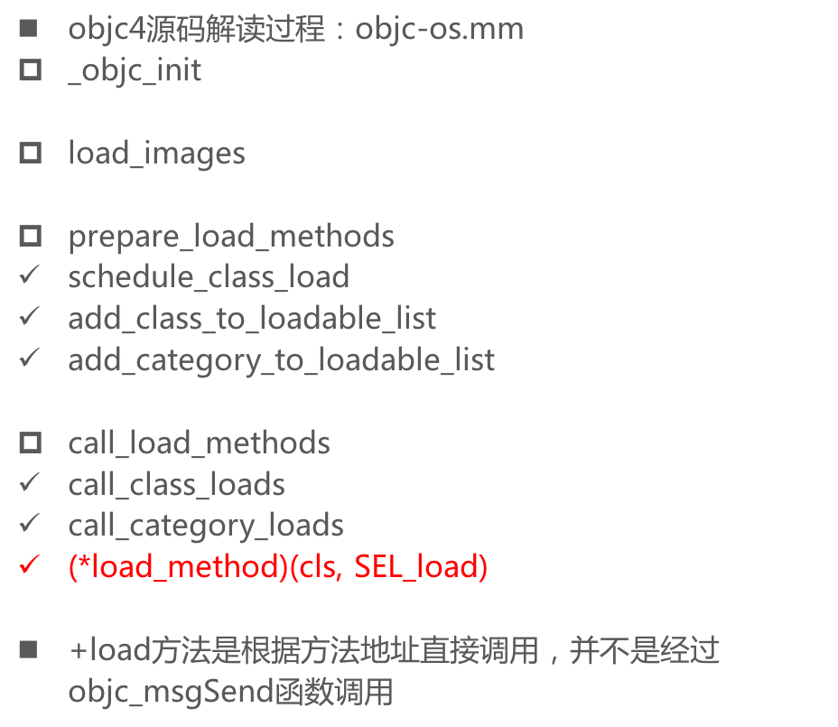

- +initialize方法

```
+initialize方法会在类第一次接收到消息时调用

调用顺序
- 先调用父类的+initialize，再调用子类的+initialize
- (先初始化父类，再初始化子类，每个类只会初始化1次)
```


- load、initialize方法的区别什么？

```
+initialize和+load的很大区别是，+initialize是通过objc_msgSend进行调用的，所以有以下特点

如果子类没有实现+initialize，会调用父类的+initialize（所以父类的+initialize可能会被调用多次）
如果分类实现了+initialize，就覆盖类本身的+initialize调用
```

- `总结`: load、initialize方法的区别什么？它们在category中的调用的顺序？以及出现继承时他们之间的调用过程？

```
1.调用方式
1> load是根据函数地址直接调用
2> initialize是通过objc_msgSend调用

2.调用时刻
1> load是runtime加载类、分类的时候调用（只会调用1次）
2> initialize是类第一次接收到消息的时候调用，每一个类只会initialize一次（父类的initialize方法可能会被调用多次）

load、initialize的调用顺序？
1.load
1> 先调用类的load
a) 先编译的类，优先调用load
b) 调用子类的load之前，会先调用父类的load

2> 再调用分类的load
a) 先编译的分类，优先调用load

2.initialize
1> 先初始化父类
2> 再初始化子类（可能最终调用的是父类的initialize方法）
```


#### Block

##### block原理

- OC代码

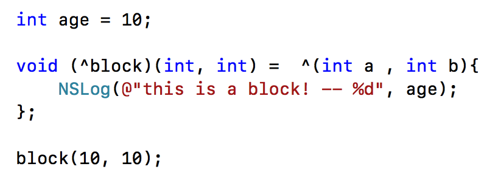

- 底层实现

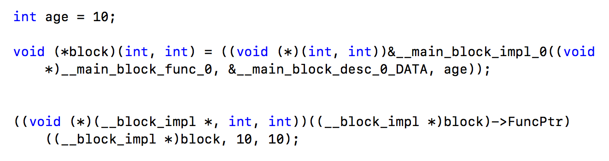

- 底层结构

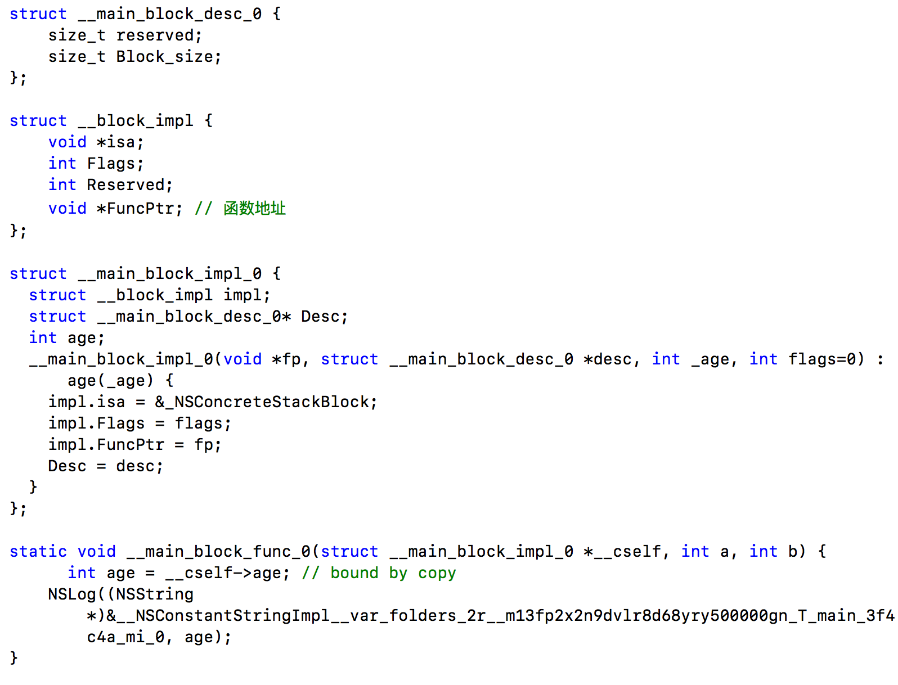

##### block变量捕获

为了保证block内部能够正常访问外部的变量，block有个变量捕获机制

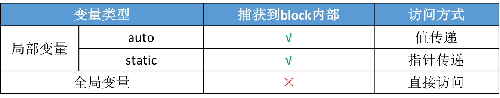

##### block类型

block有3种类型，可以通过调用class方法或者isa指针查看具体类型，最终都是继承自`NSBlock`类型

- \__NSGlobalBlock__ （ _NSConcreteGlobalBlock ）
- \__NSStackBlock__ （ _NSConcreteStackBlock ）
- \__NSMallocBlock__ （ _NSConcreteMallocBlock ）

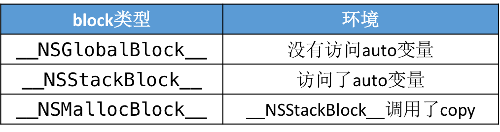

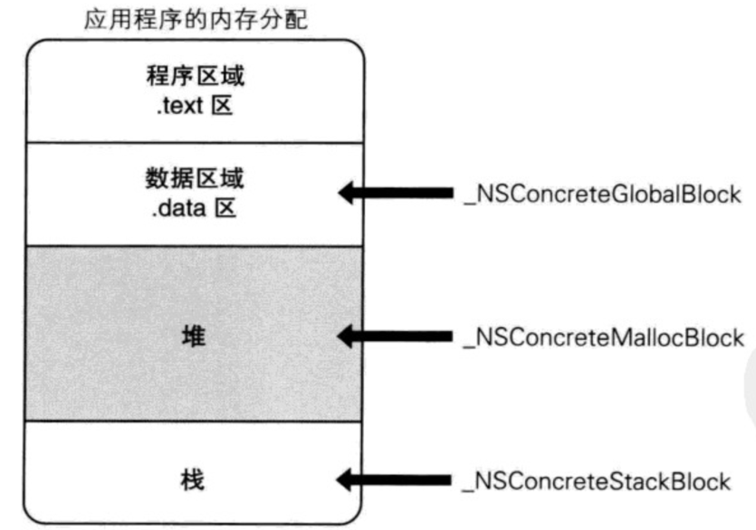

每一种类型的block调用copy后的结果如下所示:


##### block的copy

```objc
在ARC环境下，编译器会根据情况自动将栈上的block复制(copy)到堆上，比如以下情况
- block作为函数返回值时
- 将block赋值给__strong指针时
- block作为Cocoa API中方法名含有usingBlock的方法参数时
- block作为GCD API的方法参数时

MRC下block属性的建议写法, 将栈上的block复制(copy)到堆上
@property (copy, nonatomic) void (^block)(void);

ARC下block属性的建议写法
@property (strong, nonatomic) void (^block)(void);
@property (copy, nonatomic) void (^block)(void);

```

##### 对象类型的auto变量

```objc
当block内部访问了"对象类型"的auto变量时
如果block是在栈上，将不会对auto变量产生强引用

如果block被拷贝到堆上
会调用block内部的copy函数
copy函数内部会调用_Block_object_assign函数
_Block_object_assign函数会根据auto变量的修饰符（__strong、__weak、__unsafe_unretained）做出相应的操作，形成强引用（retain）或者弱引用

如果block从堆上移除
会调用block内部的dispose函数
dispose函数内部会调用_Block_object_dispose函数
_Block_object_dispose函数会自动释放引用的auto变量（release）

```

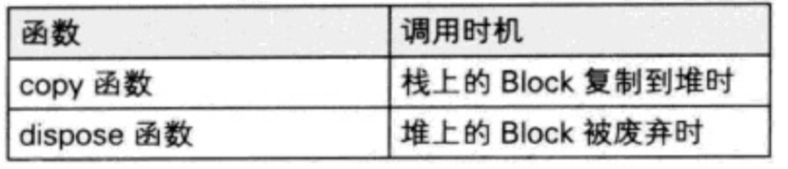

#### __block修饰符

```
__block可以用于解决block内部无法修改auto变量值的问题
__block不能修饰全局变量、静态变量（static）
```

- 编译器会将__block变量包装成一个对象

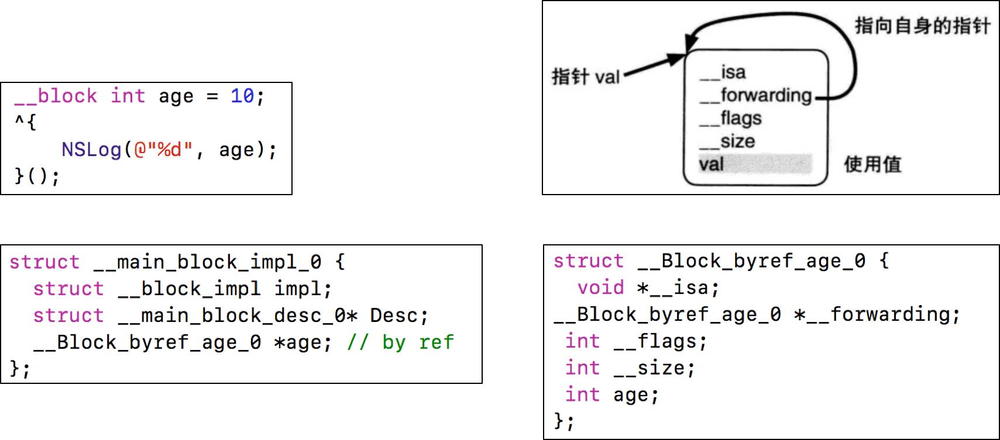

- __block的内存管理
	- 当block在栈上时，并不会对__block变量产生强引用
	- 当block被copy到堆时
		- 会调用block内部的copy函数
		- copy函数内部会调用\_Block\_object\_assign函数
		- \_Block\_object\_assign函数会对__block变量形成强引用（retain）

	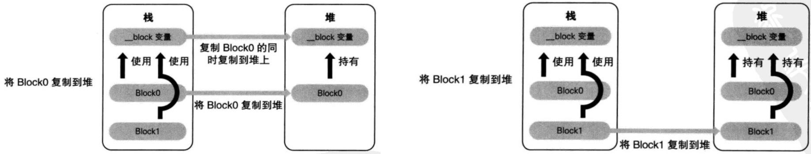
	
	- 当block从堆中移除时
		- 会调用block内部的dispose函数
dispose函数内部会调用\_Block\_object\_dispose函数
\_Block\_object\_dispose函数会自动释放引用的__block变量（release）
		
		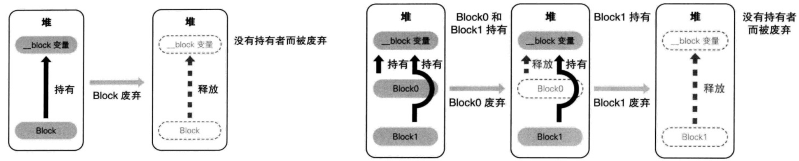

- ____block的__forwarding指针
	
	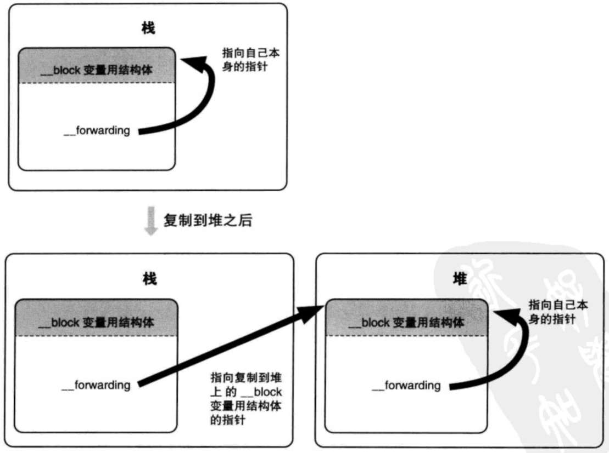

- 对象类型的auto变量、__block变量

```
```

#### block相关问题

- block的原理是怎样的？本质是什么？

```
封装了函数调用以及调用环境的OC对象

本质: OC对象, 继承自NSBlock
```

- __block的作用是什么？有什么使用注意点？

```
__block可以用于解决block内部无法修改auto变量值的问题

```

- block的属性修饰词为什么是copy？使用block有哪些使用注意？

```
block一旦没有进行copy操作，就不会在堆上
使用注意：循环引用问题
```

- block在修改NSMutableArray，需不需要添加__block？

```
```
