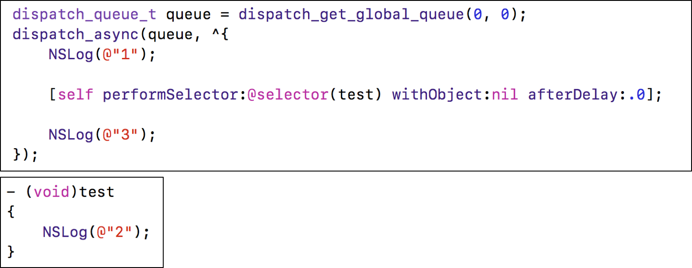
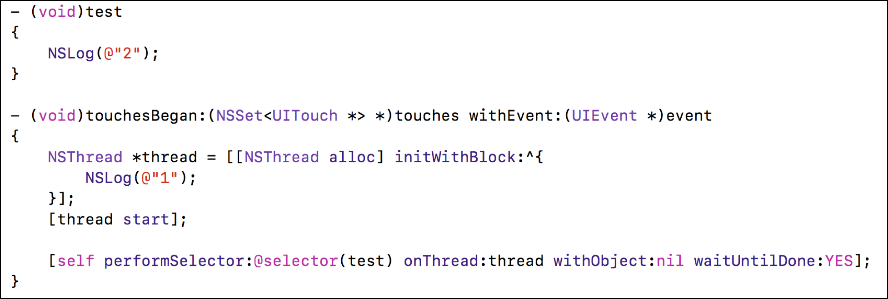
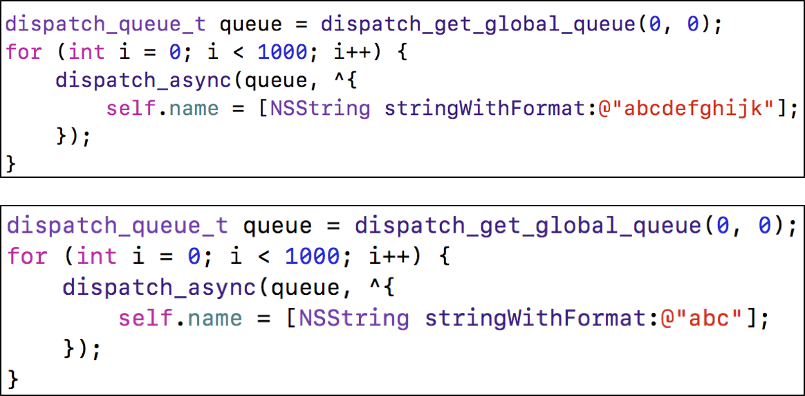

# Questions

1. [OC语法](#OC语法)
2. [Runtime](#runtime)
3. [RunLoop](#runLoop)
4. [多线程](#多线程)
5. [内存管理](#内存管理)
6. [性能优化](#性能优化)
7. [设计模式与架构](#设计模式与架构)

## OC语法

- 一个NSObject对象占用多少内存？

```
系统分配了16个字节给NSObject对象
NSObject对象内部只使用了8个字节的空间, 用于存储isa指针
```

- 对象的isa指针指向哪里？

```
instance对象的isa指向class对象
class对象的isa指向meta-class对象
meta-class对象的isa指向基类的meta-class对象

从64bit开始，isa需要进行一次位运算(& ISA_MASK)，才能计算出真实地址
```

- OC的类信息存放在哪里？

```
OC对象主要分为3种:
- instance对象, 存放成员变量的具体值
- class对象, 存放对象方法、属性、成员变量、协议信息
- meta-class对象, 存放类方法

meta-class对象和class对象的内存结构是一样的, 都是struct objc_class
```

- iOS用什么方式实现对一个对象的KVO？(KVO的本质是什么？)

```
KVO的全称是Key-Value Observing，俗称“键值监听”，可以用于监听某个对象属性值的改变

1.利用RuntimeAPI动态生成一个子类
2.将当前对象的isa指向这个全新的子类
3.当修改当前对象对象的属性值时，会通过isa找到这个子类的set方法
4.set方法中会调用Foundation的_NSSetXXXValueAndNotify函数

_NSSetXXXValueAndNotify内部实现:
- willChangeValueForKey:
- 父类原来的setter
- didChangeValueForKey: 内部会触发监听器（Oberser）的监听方法(observeValueForKeyPath:ofObject:change:context:）
```

- 如何手动触发KVO？

```
手动调用willChangeValueForKey:和didChangeValueForKey:
```

- 直接修改成员变量会触发KVO么？

```
不会, KVO的触发是通过在set方法的内部中调用:
willChangeValueForKey和didChangeValueForKey
```

- 通过KVC修改属性会触发KVO么？

```
会触发
KVO的本质是通过运行时创建当前对象的子类, 将当前对象的isa指针指向这个子类, 
KVC的赋值过程中, 通过isa指针, 找到该子类中的set方法
这个子类在set方法中, 会赋值并通知观察者值的改变
```

- KVC的赋值和取值过程是怎样的？原理是什么？

```
KVC的全称是Key-Value Coding，俗称“键值编码”，可以通过一个key来访问某个属性

赋值过程:
1. 按照setKey, _setKey顺序查找方法, 找到直接调用方法
2. 没有找到, 判断是否允许直接访问成员变量 (accessInstanceVariablesDirectly, 该方法返回值默认为YES)
3. 不允许, 调用setValue:forUndefineKey:方法, 并抛出异常
4. 允许, 按照_key, _isKey, key, isKey 顺序查找成员变量, 找到直接赋值
5. 没有找到, 调用setValue:forUndefineKey:, 并抛出异常

取值过程:
1. 按照getKey, key, isKey, _key顺序查找方法, 找到直接调用方法
2. 没有找到, 判断是否允许直接访问成员变量
3. 不允许, 调用valueForUndefineKey:方法, 并抛出异常
4. 允许, 按照_key, _isKey, key, isKey顺序查找成员变量, 找到直接复制
5. 没有找到, 调用valueForUndefineKey:方法, 并抛出异常
```

- Category的使用场合是什么？

```
分类是用于给原有类添加方法的
分类只能添加方法, 不能直接添加成员变量
分类中的@property, 只会生成setter/getter方法的声明, 不会生成实现以及私有的成员变量
```

- Category的实现原理

```
Category编译之后, 生成了一个category_t结构体对象
里面存储着分类的对象方法、类方法、属性、协议

在程序运行的时候，通过runtime将分类中保存的数据，合并到类对象和元类对象中
```

- Category和Class Extension的区别是什么？

```
Class Extension(类拓展): 在编译的时候，它的数据就已经包含在类信息中
Category(分类): 是在运行时，才会将数据合并到类信息中
```

- Category中有load方法吗？load方法是什么时候调用的？load 方法能继承吗？

```
有load方法
load方法在runtime加载类、分类的时候调用
load是根据函数地址直接调用, 因此load方法不会被分类的覆盖

调用顺序:
- 先调用类的+load
	- 按照编译先后顺序调用（先编译，先调用）
	- 调用子类的+load之前会先调用父类的+load
- 再调用分类的+load
	- 按照编译先后顺序调用（先编译，先调用）

load方法可以继承，但是一般情况下不会主动去调用load方法，都是让系统自动调用
```

- load、initialize方法的区别什么？它们在category中的调用的顺序？以及出现继承时他们之间的调用过程？

```
load方法: 类加载进内存的时候调用
initialize方法: 类第一个接收到消息的时候调用

1.调用方式
1> load是根据函数地址直接调用
2> initialize是通过objc_msgSend调用

2.调用时刻
1> load是runtime加载类、分类的时候调用（只会调用1次）
2> initialize是类第一次接收到消息的时候调用，每一个类只会initialize一次（父类的initialize方法可能会被调用多次）

load、initialize的调用顺序？
1.load
1> 先调用类的load
a) 先编译的类，优先调用load
b) 调用子类的load之前，会先调用父类的load

2> 再调用分类的load
a) 先编译的分类，优先调用load

2.initialize
1> 先初始化父类
2> 再初始化子类（可能最终调用的是父类的initialize方法）
```

- Category能否添加成员变量？如果可以，如何给Category添加成员变量？

```
默认情况下，因为分类底层结构的限制，不能添加成员变量到分类中。
但可以通过关联对象来间接实现

关联对象并不是存储在被关联对象的内存中,
而是存储在一个全局统一的AssociationsManager中
manager.map = 
{
 "对象1" : objectAssociationMap,
 "对象2" : objectAssociationMap {
 		//objectAssociation中保存了policy, value
 		"传入的key1": objectAssociation
 	}
}
通过设置关联对象为nil, 来移除关联对象
```

- block的原理是怎样的？本质是什么？

```
封装了函数, 以及函数调用环境的OC对象
继承自NSBlock
```

- block的属性修饰词为什么是copy？使用block有哪些使用注意？

```
Block如果没有进行copy操作, 就不会在堆上.
拷贝到堆上, 方便对block进行内存管理, 控制其生命周期进行

MRC中, block属性使用copy, 将栈上的block复制(copy)到堆上
ARC中, 被strong修饰的属性, 会自动拷贝到堆上, 因此ARC中block用copy或者strong都可以

使用注意:
当block被copy到堆中时, 会对block中强指针修饰的对象进行强引用
如果当前对象也强引用着该block, 会造成循环引用

解决循环引用:

使用以下修饰该对象类型的auto变量

ARC:
1.__weak：不会产生强引用，指向的对象销毁时，会自动让指针置为nil
2.__unsafe_unretained：不会产生强引用，不安全，指向的对象销毁时，指针存储的地址值不变

MRC:
__unsafe_unretained
```

- __block的作用是什么？有什么使用注意点？

```
__block可以用于解决block内部无法修改auto变量值的问题

__block本质是, 编译器会将__block修饰的变量包装成一个对象
该对象中保存了一个__forwarding指针
通过该指针找到对应的对象并修改变量值
```

- block在修改NSMutableArray，需不需要添加__block？

```
不需要.
block通过动态捕获外部的auto变量, 保存的是数组对象的地址值
可以直接根据这个地址直接进行数组的添加删除操作
```

## Runtime

- 讲一下 OC 的消息机制

```
OC中的方法调用其实都是转成了objc_msgSend函数的调用，给receiver（方法调用者）发送了一条消息（selector方法名）

objc_msgSend底层有3大阶段:
消息发送（当前类、父类中查找）、动态方法解析、消息转发
```

- 消息发送流程

```
消息发送阶段:
1. 消息接收者是否为nil? 
2. 不为nil, 从方法缓存中查找, 找到直接调用
3. 缓存中没有, 去方法列表中查找, 如果找到就调用该方法, 并且将该方法缓存中
4. 当前类方法列表中找不到, 通过superclass指针, 去父类的方法列表中查找, 如果找到就调用该方法, 并且将该方法存在缓存中

动态方法解析
5. 如果通过superclass都没有找到, 判断是否做过动态解析
6. 如果没有会调用+resolveInstanceMethod:或+resolveClassMethod:来动态解析方法(在该方法中可以动态添加方法), 并标记为做过动态解析, 从新走一遍消息发送流程

消息转发
7. 如果已经做过动态解析, 则进入消息转发
- 调用消息转发(forwardingTargetForSelector:)方法, 通过返回值转发给其他目标对象, 进行消息发送
- 如果返回值为nil, 调用方法签名(methodSignatureForSelector:方法), 返回值为nil, 调用doesNotRecognizeSelector:方法
- 返回值不为nil, 调用转发invocation(forwardInvocation:方法)
```

- 什么是Runtime？平时项目中有用过么？

```
OC是一门动态性比较强的编程语言，允许很多操作推迟到程序运行时再进行
OC的动态性就是由Runtime来支撑和实现的，Runtime是一套C语言的API，封装了很多动态性相关的函数
平时编写的OC代码，底层都是转换成了Runtime API进行调用
```
- Runtime具体应用

```
利用关联对象（AssociatedObject）给分类添加属性
遍历类的所有成员变量（修改textfield的占位文字颜色、字典转模型、自动归档解档）
交换方法实现（交换系统的方法）
利用消息转发机制解决方法找不到的异常问题
......
```

##### 代码分析

```objc
@interface Person : NSObject

@property (copy, nonatomic) NSString *name;

@end

@implementation Person

- (void)print
{
    NSLog(@"my name is %@", self->_name);
}

@end
```
- 打印结果分别是什么？

```objc
@interface Student : Person
@end

@implementation Student

- (instancetype)init {
    
    if (self = [super init]) {
        
		[self class]; // Student
		[self superclass]; // Person

		// objc_msgSendSuper({self, currentClass}, @selector(class));
		// super调用方法时候, 消息接收者依然是self(方法调用者)
		// 传入一个currentClass, 找到superClass, 表示从父类开始查找class方法
		[super class]; // Student
		[super superclass]; // Person
    }
    return self;
}

@end

```

```objc
// NSObject元类对象中的superclass指针指向NSObject的类对象
[NSObject isKindOfClass:[NSObject class]]; //YES

[NSObject isMemberOfClass:[NSObject class]]; // NO
[Person isKindOfClass:[NSObject class]]; // NO
[Person isMemberOfClass:[NSObject class]]; // NO

// isKindOfClass和isMemberOfClass的底层实现
@implementation NSObject

// 当前对象的类对象 是否等于 传入的类对象 
- (BOOL)isMemberOfClass:(Class)cls {
    return [self class] == cls;
}

// 当前对象的类对象 是否等于 传入的类对象或者类对象的父类
- (BOOL)isKindOfClass:(Class)cls {
    for (Class tcls = [self class]; tcls; tcls = tcls->superclass) {
        if (tcls == cls) return YES;
    }
    return NO;
}

// 当前类对象的元类对象 是否等于 传入的元类对象
+ (BOOL)isMemberOfClass:(Class)cls {
    return object_getClass((id)self) == cls;
}

// 当前类对象的元类对象 是否等于 传入的元类对象或者元类对象的父类
+ (BOOL)isKindOfClass:(Class)cls {
    for (Class tcls = object_getClass((id)self); tcls; tcls = tcls->superclass) {
        if (tcls == cls) return YES;
    }
    return NO;
}
@end
```

- 以下代码能不能执行成功？如果可以，打印结果是什么？

```objc
- (void)viewDidLoad {
	[super viewDidLoad];
	/*
	结构体: {
		self,
		superClass
	}
	
	objc_msgSendSuper({self, [UIViewController class]}, @selector(viewDidLoad));
	*/
	
	// 如果初始化该字符串变量, 打印结果: 123
	// NSString *test = "123";
	
	id cls = [Person class];
	void *obj = &cls;
	[(__bridge id)obj print];
}
```

```
可以执行成功, 不崩溃
打印self (打印cls前面地址中保存的数据)

print可以调用成功: 
调用方法的本质, 找到类对象, 找到相应的对象方法

栈帧: 高地址 -> 低地址 入栈
```

## RunLoop

- 讲讲 RunLoop，项目中有用到吗？

```
主要做用:
控制线程生命周期（线程保活）, 
如果想要在子线程中频繁操作,可以通过runloop控制线程的生命周期, 减少线程的重复创建

解决NSTimer在滑动时停止工作的问题
监控应用卡顿
性能优化
```

- runloop内部实现逻辑？

```
运行循环
相当于do while循环中不断处理消息
没有消息的时候进入休眠, 等待其他消息唤醒
处理完消息后, 会根据对应的返回值来决定是否退出当前循环

每条线程都有一个与之对应的runloop对象
主线程的RunLoop在程序运行中自动创建
子线程的Runloop在当前线程第一个获取runloop对象的时候创建

一个Runloop对象中, 保存了很多模式
每个模式中保存一堆集合: source0, source1, observers, timers
runloop对象会选择其中一个模式作为当前模式

当runloop开始运行:
- 1. 通知observers: 进入循环
- 2. 通知observers: 即将开始处理Timers, 即将处理Sources
- 3. 处理Blocks和Source0
- 4. 判断是否有source1
	- 没有source1, 通知observers开始休眠
- 5. 通知observers结束休眠
	- 处理Timer, GCD
	- 处理Source1 (如果刚刚有source1会先处理source1)
- 6. 根据执行结果(是否等于0)
	-  回到第2步
	-  退出当前循环
```

- runloop和线程的关系？

```
每条线程都有唯一的一个与之对应的RunLoop对象
RunLoop保存在一个全局的字典里，线程作为key，RunLoop作为value

线程刚创建时并没有RunLoop对象，RunLoop会在第一次获取它时创建
主线程的RunLoop已经自动获取（创建），子线程默认没有开启RunLoop

RunLoop会在线程结束时销毁
```

- timer 与 runloop 的关系？

```
常见的2种Mode:
kCFRunLoopDefaultMode（NSDefaultRunLoopMode）：App的默认Mode，通常主线程是在这个Mode下运行
UITrackingRunLoopMode：界面跟踪 Mode，用于 ScrollView 追踪触摸滑动，保证界面滑动时不受其他 Mode 影响
```

- 程序中添加每3秒响应一次的NSTimer，当拖动tableview时timer可能无法响应要怎么解决？

```
当scrollView滚动的时候
会从默认模式(NSDefaultRunLoopMode), 切换为跟踪模式(UITrackingRunLoopMode)
在跟踪模式下, timer无法响应

每个runLoop对象有一个commonModes集合
通过将timer标记为commonMode, 表示定时器在commonModes集合中的模式都可以运行
```

- runloop 是怎么响应用户操作的， 具体流程是什么样的？

```
通过source1捕捉用户的触摸操作, 捕捉到系统事件后, 包装成source0进行处理
```

- 说说runLoop的几种状态

```
kCFRunloopEntry 即将进入Loop
kCFRunLoopBeforeTimers 即将处理Timer
kCFRunloopBeforeSources 即将处理Source
kCFRunloopBeforeWaiting 即将进入休眠
kCFRunloopAfterWaiting 刚从休眠中唤醒
kCFRunloopExit 即将推出loop
```

- runloop的mode作用是什么？

```
分隔不同模式下的Source0/Source1/Timer/Observer
通过不同的运行模式, 隔离不同的事件
```

## 多线程

- 你理解的多线程？

```
每个程序在运行中会开启一个进程, 每个进程中至少开启一条线程(主线程), 来处理任务
为了提高效率，可以在一个进程中开启多个线程, 并发执行不同任务

一般在主线程中刷新UI, 子线程中处理一些耗时操作(如图片下载)

iOS中常用多线程实现方案:
pthread, NSThread, GCD, NSOperation 
```

- iOS的多线程方案有哪几种？你更倾向于哪一种？

```
pthread, NSThread (对pthread的封装)
GCD, NSOperation (对GCD的封装)
```

- 你在项目中用过 GCD 吗？

```
GCD中有2个用来执行任务的函数: 同步函数 和 异步函数

- 并发队列（Concurrent Dispatch Queue）
	- 可以让多个任务并发（同时）执行（自动开启多个线程同时执行任务）
	- 并发功能只有在异步（dispatch_async）函数下才有效

- 串行队列（Serial Dispatch Queue）
	- 让任务一个接着一个地执行（一个任务执行完毕后，再执行下一个任务）

死锁:
使用 同步函数 往 当前串行队列 中添加任务，会卡住当前的串行队列（产生死锁）
```

- GCD 的队列类型

```
- 并发队列（Concurrent Dispatch Queue）
	- 可以让多个任务并发（同时）执行（自动开启多个线程同时执行任务）
	- 并发功能只有在异步（dispatch_async）函数下才有效

- 串行队列（Serial Dispatch Queue）
	- 让任务一个接着一个地执行（一个任务执行完毕后，再执行下一个任务）

主队列(串行):
dispatch_get_main_queue()

全局并发队列: 
//第一个参数: 优先级 第二个参数: 预留值
dispatch_get_global_queue(DISPATCH_QUEUE_PRIORITY_DEFAULT, 0); 
```

- 说一下 OperationQueue 和 GCD 的区别，以及各自的优势

```
NSOperation是对GCD的封装, 更加面向对象
```

- 线程安全的处理手段有哪些？同步方案?

```
线程安全处理手段:
- 对任务进行加锁/解锁操作
- 将任务放在同一个串行队列中(dispatch_queue(DISPATCH_QUEUE_SERIAL))
- 信号量(将信号量值设为1)
```

- OC你了解的锁有哪些？在你回答基础上进行二次提问；
	- 追问一：自旋和互斥对比？
	- 追问二：使用以上锁需要注意哪些？
	- 追问三：用C/OC/C++，任选其一，实现自旋或互斥？口述即可！

```
OSSpinLock
"自旋锁"，等待锁的线程会处于忙等（busy-wait）状态，一直占用着CPU资源
目前已经不再安全，可能会出现优先级反转问题
如果等待锁的线程优先级较高，它会一直占用着CPU资源，优先级低的线程就无法释放锁

os_unfair_lock
os_unfair_lock用于取代不安全的OSSpinLock ，从iOS10开始才支持
从底层调用看，等待os_unfair_lock锁的线程会处于休眠状态，并非忙等

pthread_mutex
mutex叫做”互斥锁”，等待锁的线程会处于休眠状态

NSLock
NSLock是对mutex普通锁的封装

NSRecursiveLock
NSRecursiveLock也是对mutex递归锁的封装，API跟NSLock基本一致

NSCondition
NSCondition是对mutex和cond的封装

NSConditionLock
NSConditionLock是对NSCondition的进一步封装，可以设置具体的条件值

@synchronized
@synchronized是对mutex递归锁的封装
@synchronized(obj)内部会生成obj对应的递归锁，然后进行加锁、解锁操作
```

```
自旋锁, 等待锁的线程会处于忙等（busy-wait）状态，一直占用着CPU资源
互斥锁，等待锁的线程会处于休眠状态, 不占用CPU资源

线程等待锁的时间较长时, 可以考虑使用自旋锁
时间较长, 使用互斥锁

什么情况使用自旋锁比较划算？
	- 预计线程等待锁的时间很短
	- 加锁的代码（临界区）经常被调用，但竞争情况很少发生
	- CPU资源不紧张
	- 多核处理器

什么情况使用互斥锁比较划算？
	- 预计线程等待锁的时间较长
	- 单核处理器
	- 临界区有IO操作
	- 临界区代码复杂或者循环量大
	- 临界区竞争非常激烈
```

- 同步方案性能对比

```
性能从高到低排序
os_unfair_lock(iOS 10)
OSSpinLock (自旋锁, 占用CPU资源, 线程优先级问题)
dispatch_semaphore (信号量, 将信号量值设置为1)
pthread_mutex
dispatch_queue(DISPATCH_QUEUE_SERIAL)
NSLock
NSCondition
pthread_mutex(recursive)
NSRecursiveLock
NSConditionLock
@synchronized
```

- atomic 和 nonatomic

```
atomic:线程安全的, 用于保证属性setter、getter的原子性操作
本质是在setter和getter内部加了线程同步的锁(spinlock_t, 自旋锁, 占用CPU资源)
它并不能保证使用属性的过程是线程安全的
```

- 读写安全方案

```
同一时间，只能有1个线程进行写的操作
同一时间，允许有多个线程进行读的操作
同一时间，不允许既有写的操作，又有读的操作

“多读单写”，经常用于文件等数据的读写操作

iOS中的实现方案有:
pthread_rwlock：读写锁

dispatch_barrier_async：异步栅栏调用
这个函数传入的并发队列必须是自己通过dispatch_queue_cretate创建的
如果传入的是一个串行或是一个全局的并发队列，那这个函数便等同于dispatch_async函数的效果

```

#### 代码分析

- 请问下面代码的打印结果是什么？



```
打印结果是：1、3
原因:
performSelector:withObject:afterDelay:
本质是往Runloop中添加定时器, 子线程默认没有启动Runloop
```



```
打印结果是：1, 造成崩溃(等待执行任务过程中, 目标线程已经退出)
原因:

performSelector:onThread:
本质是唤醒当前线程的runloop, 并处理消息
thread调用start方法, 执行完打印1的任务后, 线程就退出了
可以通过runLoop进行线程保活
```

## 内存管理

- 使用CADisplayLink、NSTimer有什么注意点？

```
CADisplayLink、NSTimer会对传入的target产生强引用
如果target又对它们产生强引用，那么就会引发循环引用

解决方案:
- Block
- 使用代理对象(NSProxy), 转发方法调用

NSTimer依赖于RunLoop，如果RunLoop的任务过于繁重，可能会导致NSTimer不准时
GCD的定时器会更加准时
```

- 介绍下内存的几大区域

```
保留
代码段: 编译之后的代码
数据段: 
	- 字符串常量
	- 全局变量, 静态变量 (已初始化/未初始化)
堆: 通过alloc, malloc, calloc等动态分配的空间
栈: 函数调用的开销, 从 高->低 分配内存地址
内核区

地址: 上 -> 下, 低 -> 高
```

- Tagged Pointer

```
从64bit开始，iOS引入了Tagged Pointer技术
用于优化NSNumber、NSDate、NSString等小对象的存储

在没有使用Tagged Pointer之前， NSNumber等对象需要动态分配内存、维护引用计数等，NSNumber指针存储的是堆中NSNumber对象的地址值
使用Tagged Pointer之后，NSNumber指针里面存储的数据变成了：Tag + Data，也就是将数据直接存储在了指针中, 当指针不够存储数据时，才会使用动态分配内存的方式来存储数据
```

- 思考以下2段代码能发生什么事？有什么区别？



```
第一段代码崩溃, 第二段代码正常运行

原因: 

第一段:
self.name的本质是调用setter方法
ARC下中setter方法本质, 生成ARC相关代码, 最终会调用_name的release方法
多个线程操作同一个对象, _name对象会被释放两次, 造成坏内存访问

解决方案: 1. 加锁  2. atomic修饰name属性

第二段:
使用了Tagged Pointer, 直接从地址中取值, 没有管理对象的相关代码
```

- 讲一下你对 iOS 内存管理的理解

```
在iOS中，使用引用计数来管理OC对象的内存
一个新创建的OC对象引用计数默认是1，当引用计数减为0，OC对象就会销毁，释放其占用的内存空间
调用retain会让OC对象的引用计数+1，调用release会让OC对象的引用计数-1

MRC: 手动内存管理
ARC: 自动内存管理 (ARC是LLVM编译器和Runtime系统相互协作的一个结果)
```

- ARC 都帮我们做了什么？

```
LLVM + Runtime
使用LLVM生成内存管理的相关代码
调用Runtime, 计算对象引用计数, 进行内存管理
```

- copy和mutableCopy, 深拷贝和浅拷贝

```
拷贝的目的：产生一个副本对象，跟源对象互不影响

iOS提供了2个拷贝方法
1.copy，不可变拷贝，产生不可变副本
2.mutableCopy，可变拷贝，产生可变副本
 
iOS中的拷贝分为: 深拷贝和浅拷贝
1.深拷贝：内容拷贝，产生新的对象
2.浅拷贝：指针拷贝，没有产生新的对象
 
判断深拷贝还是浅拷贝:
根据拷贝后的对象是否会影响原来的对象

集合对象: NSArray, NSMutableArray, NSString, NSMutableString等...

copy, 会判断被拷贝的集合对象是否是可变的
	- 不可变的, 浅拷贝
	- 可变的, 深拷贝
NSMutableCopy 拷贝集合对象都是深拷贝
```

- weak指针的实现原理

```
__weak：不会产生强引用，指向的对象销毁时，会自动让指针置为nil
__unsafe_unretained：不会产生强引用，不安全，指向的对象销毁时，指针存储的地址值不变

当一个对象要释放时，会自动调用dealloc
dealloc方法中会, 根据当前对象的isa指针判断当前对象是否存在弱引用
isa指针, 是通过共用体的形式, 记录了当前对象是否存在弱引用
(weakly_referenced, 占用8个字节)
```

- @autoreleasePool实现原理

```
定义了一个__AtAutoreleasePool结构体变量
调用构造函数atautoreleasepoolobj = objc_autoreleasePoolPush()

当前代码块执行完毕之后, 当前变量被销毁, 调用它的析构函数, objc_autoreleasePoolPop(atautoreleasepoolobj);

通过AutoreleasePoolPage对象(4096个字节), 存储当前自动释放池中调用了autorelease的对象的地址值
不够存储的时候, 会创建新的AutoreleasePoolPage对象
这些AutoreleasePoolPage对象之间通过双向链表形式连接在一起

调用push方法会将一个POOL_BOUNDARY入栈，并且返回其存放的内存地址(atautoreleasepoolobj)

调用pop方法时传入一个POOL_BOUNDARY的内存地址(atautoreleasepoolobj)
会从最后一个入栈的对象开始发送release消息，直到遇到这个POOL_BOUNDARY
```

- autorelease中的对象在什么时机会被调用release

```
autorelease中的对象调用release由Runloop决定

iOS在主线程的Runloop中注册了2个Observer:

第1个Observer监听了kCFRunLoopEntry事件(进入runloop), 会调用objc_autoreleasePoolPush()

第2个Observer
- 监听了kCFRunLoopBeforeWaiting事件(runloop休眠)，会调用objc_autoreleasePoolPop()、objc_autoreleasePoolPush()
- 监听了kCFRunLoopBeforeExit事件(runloop退出)，会调用objc_autoreleasePoolPop()
```

- 方法里有局部对象， 出了方法后会立即释放吗

```
具体看ARC生成的release代码方法:
- 1. 通过调用对象的autorelease方法对当前对象进行释放的话, 是在runloop休眠之前进行释放
- 2. 直接在代码后面插入调用当前对象的release方法, 会立即释放
```

- imageNamed:和imageWithContentsOfFile:区别

```
imageNamed: 通过文件名加载图片
- 通过传入的名字, 去文件夹中遍历查找对应的图片
- 将找到图片保存在内存缓存中, 方便下一次使用

imageWithContentsOfFile: 根据图片路径加载图片
- 图像数据不会被缓存

使用选择:
- 当图片文件较小, 使用比较频繁的时候那么使用imageNamed:
- 当该图片使用次数较少时, 可以考虑使用imageWithContentsOfFile:
```