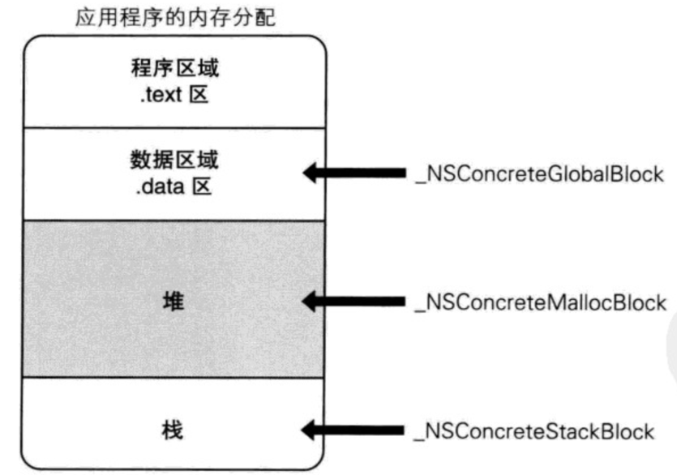
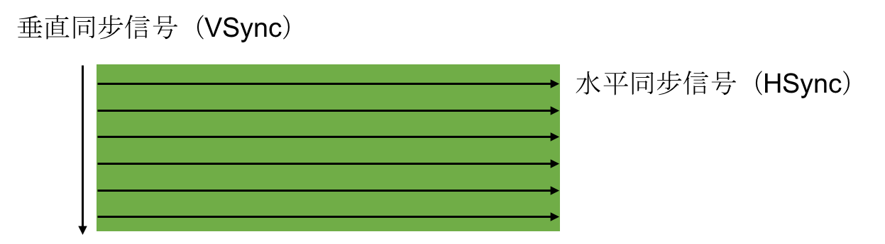

# iOS
1. [OC语法](#OC语法)
	- [KVO](#KVO)
	- [KVC](#KVC)
	- [Category](#Category)
	- [Block](#Block)
2. [Runtime](#runtime)
3. [RunLoop](#runLoop)
4. [多线程](#多线程)
5. [内存管理](#内存管理)
6. [性能优化](#性能优化)
7. [设计模式与架构](#设计模式与架构)
8. [其他](#其他)

## OC语法
#### 面向对象

- 一个NSObject对象占用多少内存？

```
系统分配了16个字节给NSObject对象（通过malloc_size函数获得）
但NSObject对象内部只使用了8个字节的空间（64bit环境下，可以通过class_getInstanceSize函数获得）
```


- 对象的isa指针指向哪里？

```
instance对象的isa指向class对象
class对象的isa指向meta-class对象
meta-class对象的isa指向基类的meta-class对象

备注: 从64bit开始，isa需要进行一次位运算(& ISA_MASK)，才能计算出真实地址
```


- OC的类信息存放在哪里？

```
OC对象主要分为3种:
- instance对象, 存放成员变量的具体值
- class对象, 存放对象方法、属性、成员变量、协议信息
- meta-class对象, 存放类方法

meta-class对象和class对象的内存结构是一样的, 都是struct objc_class
```

#### KVO

KVO的全称是Key-Value Observing，俗称“键值监听”，可以用于监听某个对象属性值的改变


- iOS用什么方式实现对一个对象的KVO？(KVO的本质是什么？)

```
1.利用RuntimeAPI动态生成一个子类
2.让instance对象的isa指向这个全新的子类
3.当修改instance对象的属性时，会调用Foundation的_NSSetXXXValueAndNotify函数

_NSSetXXXValueAndNotify内部实现:
- willChangeValueForKey:
- 父类原来的setter
- didChangeValueForKey: 内部会触发监听器（Oberser）的监听方法(observeValueForKeyPath:ofObject:change:context:）
```

- 如何手动触发KVO？

```
手动调用willChangeValueForKey:和didChangeValueForKey:
```

- 直接修改成员变量会触发KVO么？

```
不会触发KVO
```

#### KVC
KVC的全称是Key-Value Coding，俗称“键值编码”，可以通过一个key来访问某个属性

- KVC的赋值和取值过程是怎样的？原理是什么？

```
见下图...
accessInstanceVariablesDirectly方法的默认返回值是YES
```

- setValue:forKey:的原理
	


- valueForKey:的原理


- 通过KVC修改属性会触发KVO么？

```
会触发KVO
```


#### Category

- Category的使用场合是什么？

```
分类是用于给原有类添加方法的, 它只能添加方法, 在Category中不能直接添加成员变量
分类中的@property, 只会生成setter/getter方法的声明, 不会生成实现以及私有的成员变量
```

- Category的实现原理?

```
Category编译之后的底层结构是struct category_t，里面存储着分类的对象方法、类方法、属性、协议信息
在程序运行的时候，runtime会将Category的数据，合并到类信息中（类对象、元类对象中）
```


- Category的加载处理过程

```
1. 通过Runtime加载某个类的所有Category数据
2. 把所有Category的方法、属性、协议数据，合并到一个大数组中
	- 后面参与编译的Category数据，会在数组的前面
3. 将合并后的分类数据（方法、属性、协议），插入到类原来数据的前面

```

- Category和Class Extension的区别是什么？

```
Class Extension在编译的时候，它的数据就已经包含在类信息中
Category是在运行时，才会将数据合并到类信息中
```

#### 关联对象

- Category能否添加成员变量？如果可以，如何给Category添加成员变量？

```
默认情况下，因为分类底层结构的限制，不能添加成员变量到分类中。
但可以通过关联对象来间接实现

关联对象提供了以下API:
- 添加关联对象
void objc_setAssociatedObject(id object, const void * key,
                                id value, objc_AssociationPolicy policy)
- 获得关联对象
id objc_getAssociatedObject(id object, const void * key)
- 移除所有的关联对象
void objc_removeAssociatedObjects(id object)

```

- objc_AssociationPolicy


- 关联对象的原理

```
实现关联对象技术的核心对象有:
AssociationsManager
AssociationsHashMap
ObjectAssociationMap
ObjcAssociation
```


#### +Load方法 和 +initialize方法

- +Load方法

```
+load方法会在runtime加载类、分类时调用
每个类、分类的+load，在程序运行过程中只调用一次

调用顺序:
- 先调用类的+load
	- 按照编译先后顺序调用（先编译，先调用）
	- 调用子类的+load之前会先调用父类的+load
- 再调用分类的+load
	- 按照编译先后顺序调用（先编译，先调用）
```


- +initialize方法

```
+initialize方法会在类第一次接收到消息时调用

调用顺序
- 先调用父类的+initialize，再调用子类的+initialize
- (先初始化父类，再初始化子类，每个类只会初始化1次)
```


- load、initialize方法的区别什么？

```
+initialize和+load的很大区别是，+initialize是通过objc_msgSend进行调用的，所以有以下特点

如果子类没有实现+initialize，会调用父类的+initialize（所以父类的+initialize可能会被调用多次）
如果分类实现了+initialize，就覆盖类本身的+initialize调用
```

- `总结`: load、initialize方法的区别什么？它们在category中的调用的顺序？以及出现继承时他们之间的调用过程？

```
1.调用方式
1> load是根据函数地址直接调用
2> initialize是通过objc_msgSend调用

2.调用时刻
1> load是runtime加载类、分类的时候调用（只会调用1次）
2> initialize是类第一次接收到消息的时候调用，每一个类只会initialize一次（父类的initialize方法可能会被调用多次）

load、initialize的调用顺序？
1.load
1> 先调用类的load
a) 先编译的类，优先调用load
b) 调用子类的load之前，会先调用父类的load

2> 再调用分类的load
a) 先编译的分类，优先调用load

2.initialize
1> 先初始化父类
2> 再初始化子类（可能最终调用的是父类的initialize方法）
```


### Block

##### block原理

- OC代码


- 底层实现


- 底层结构


##### block变量捕获

为了保证block内部能够正常访问外部的变量，block有个变量捕获机制


##### block类型

block有3种类型，可以通过调用class方法或者isa指针查看具体类型，最终都是继承自`NSBlock`类型

- \__NSGlobalBlock__ （ _NSConcreteGlobalBlock ）
- \__NSStackBlock__ （ _NSConcreteStackBlock ）
- \__NSMallocBlock__ （ _NSConcreteMallocBlock ）




每一种类型的block调用copy后的结果如下所示:


##### block的copy

```objc
在ARC环境下，编译器会根据情况自动将栈上的block复制(copy)到堆上，比如以下情况
- block作为函数返回值时
- 将block赋值给__strong指针时
- block作为Cocoa API中方法名含有usingBlock的方法参数时
- block作为GCD API的方法参数时

MRC下block属性的建议写法, 将栈上的block复制(copy)到堆上
@property (copy, nonatomic) void (^block)(void);

ARC下block属性的建议写法
@property (strong, nonatomic) void (^block)(void);
@property (copy, nonatomic) void (^block)(void);

```

##### 对象类型的auto变量

```objc
当block内部访问了"对象类型"的auto变量时
如果block是在栈上，将不会对auto变量产生强引用

如果block被拷贝到堆上
会调用block内部的copy函数
copy函数内部会调用_Block_object_assign函数
_Block_object_assign函数会根据auto变量的修饰符（__strong、__weak、__unsafe_unretained）做出相应的操作，形成强引用（retain）或者弱引用

如果block从堆上移除
会调用block内部的dispose函数
dispose函数内部会调用_Block_object_dispose函数
_Block_object_dispose函数会自动释放引用的auto变量（release）

```


##### __block修饰符

```
__block可以用于解决block内部无法修改auto变量值的问题
__block不能修饰全局变量、静态变量（static）
```

- 编译器会将__block变量包装成一个对象


- __block的内存管理
	- 当block在栈上时，并不会对__block变量产生强引用
	- 当block被copy到堆时
		- 会调用block内部的copy函数
		- copy函数内部会调用\_Block\_object\_assign函数
		- \_Block\_object\_assign函数会对__block变量形成强引用（retain）

	
	
	- 当block从堆中移除时
		- 会调用block内部的dispose函数
dispose函数内部会调用\_Block\_object\_dispose函数
\_Block\_object\_dispose函数会自动释放引用的__block变量（release）
		
		

- ____block的__forwarding指针
	
	

- 对象类型的auto变量、__block变量

```c
当block在栈上时，对它们都不会产生强引用

当block拷贝到堆上时，都会通过copy函数来处理它们
- __block变量（假设变量名叫做a）
	_Block_object_assign((void*)&dst->a, (void*)src->a, 8/*BLOCK_FIELD_IS_BYREF*/);

- 对象类型的auto变量（假设变量名叫做p）
	_Block_object_assign((void*)&dst->p, (void*)src->p, 3/*BLOCK_FIELD_IS_OBJECT*/);

当block从堆上移除时，都会通过dispose函数来释放它们
- __block变量（假设变量名叫做a）
	_Block_object_dispose((void*)src->a, 8/*BLOCK_FIELD_IS_BYREF*/);

- 对象类型的auto变量（假设变量名叫做p）
	_Block_object_dispose((void*)src->p, 3/*BLOCK_FIELD_IS_OBJECT*/);
```

- 被__block修饰的对象类型

```c
当__block变量在栈上时，不会对指向的对象产生强引用

当__block变量被copy到堆时, 会调用__block变量内部的copy函数
copy函数内部会调用_Block_object_assign函数
_Block_object_assign函数会根据所指向对象的修饰符（__strong、__weak、__unsafe_unretained）做出相应的操作，形成强引用（retain）或者弱引用
（注意：这里仅限于ARC时会retain，MRC时不会retain）

如果__block变量从堆上移除, 会调用__block变量内部的dispose函数
dispose函数内部会调用_Block_object_dispose函数
_Block_object_dispose函数会自动释放指向的对象（release）
```

##### 循环引用


- 解决循环引用问题 - ARC

#### block相关问题

- block的原理是怎样的？本质是什么？

```
封装了函数调用以及调用环境的OC对象

本质: OC对象, 继承自NSBlock
```

- __block的作用是什么？有什么使用注意点？

```
1. __block可以用于block内部修改auto变量值的问题
2. MRC下可以使用__block解决循环引用

__block本质是, 将所修饰的变量包装成一个对象
该对象中有一个成员变量存储着该变量的值
```

- block的属性修饰词为什么是copy？使用block有哪些使用注意？

```
ARC下修饰词使用strong或者copy都可以
MRC下面使用copy将block拷贝到堆上
block一旦没有进行copy操作，就不会在堆上

循环引用问题:
当block被copy到堆中时, 会对block中使用到__strong修饰的对象类型的auto变量进行强引用
如果当前对象也强引用着该block, 会造成循环应用

解决循环引用:
使用__weak或者__unsafe_unretained修饰该对象类型的auto变量

__weak：不会产生强引用，指向的对象销毁时，会自动让指针置为nil
__unsafe_unretained：不会产生强引用，不安全，指向的对象销毁时，指针存储的地址值不变
```

- block在修改NSMutableArray，需不需要添加__block？

```
不需要
```

## Runtime

- Objective-C是一门动态性比较强的编程语言，跟C、C++等语言有着很大的不同
- Objective-C的动态性是由Runtime API来支撑的
- Runtime API提供的接口基本都是C语言的，源码由C\C++\汇编语言编写

##### isa

- 在arm64架构之前，isa就是一个普通的指针，存储着Class、Meta-Class对象的内存地址
- 从arm64架构开始，对isa进行了优化，变成了一个共用体（union）结构，还使用位域来存储更多的信息
	


```
nonpointer
0，代表普通的指针，存储着Class、Meta-Class对象的内存地址
1，代表优化过，使用位域存储更多的信息
	
has_assoc
是否有设置过关联对象，如果没有，释放时会更快
	
has_cxx_dtor
是否有C++的析构函数（.cxx_destruct），如果没有，释放时会更快
	
shiftcls
存储着Class、Meta-Class对象的内存地址信息
	
magic
用于在调试时分辨对象是否未完成初始化
	
deallocating
对象是否正在释放
	
extra_rc
里面存储的值是引用计数器减1
	
has_sidetable_rc
引用计数器是否过大无法存储在isa中
如果为1，那么引用计数会存储在一个叫SideTable的类的属性中
```

#### Class的结构


- class\_rw\_t
	- class\_rw\_t里面的methods、properties、protocols是二维数组，是可读可写的，包含了类的初始内容、分类的内容

	

- class\_ro\_t
	- class\_ro\_t里面的baseMethodList、baseProtocols、ivars、baseProperties是一维数组，是只读的，包含了类的初始内容
 
	

- method_t: 对方法\函数的封装

	

	- IMP代表函数的具体实现
	- SEL代表方法\函数名，一般叫做选择器，底层结构跟char *类似
		- 可以通过@selector()和sel_registerName()获得
		- 可以通过sel_getName()和NSStringFromSelector()转成字符串
		- 不同类中相同名字的方法，所对应的方法选择器是相同的
	- types包含了函数返回值、参数编码的字符串

##### 方法缓存

Class内部结构中有个方法缓存（`cache_t`），用`散列表（哈希表）`来缓存曾经调用过的方法，可以提高方法的查找速度


##### objc_msgSend执行流程

OC中的方法调用，其实都是转换为objc_msgSend函数的调用, objc_msgSend的执行流程可以分为3大阶段

- 消息发送


```
如果是从class_rw_t中查找方法
- 已经排序的，二分查找
- 没有排序的，遍历查找

receiver通过isa指针找到receiverClass
receiverClass通过superclass指针找到superClass
```

- 动态方法解析


```
开发者可以实现以下方法，来动态添加方法实现
+resolveInstanceMethod:
+resolveClassMethod:

动态解析过后，会重新走“消息发送”的流程
“从receiverClass的cache中查找方法”这一步开始执行
```


- 消息转发


```
开发者可以在forwardInvocation:方法中自定义任何逻辑
以上方法都有对象方法、类方法2个版本（前面可以是加号+，也可以是减号-）
```

#### super关键字

- 通过命令行编译后

```objc
通过super调用方法的本质:
调用函数: objc_msgSendSuper(arg1, @selector(方法名)), 并传入两个参数

- 参数1: objc_super 结构体对象
struct objc_super {
	// 消息接收者: 仍然是当前对象(self)
    __unsafe_unretained _Nonnull id receiver; 
    // 消息接收者的父类: 表示从当前类开始查找方法
    __unsafe_unretained _Nonnull Class super_class; 
};

- 参数2: 具体调用的方法
```

-  真正底层实现

```objc
super调用，底层会转换为objc_msgSendSuper2函数的调用，接收2个参数

- receiver是消息接收者
- current_class是receiver的Class对象
```


#### Runtime相关问题

- 讲一下 OC 的消息机制

```
OC中的方法调用其实都是转成了objc_msgSend函数的调用，给receiver（方法调用者）发送了一条消息（selector方法名）
objc_msgSend底层有3大阶段:
消息发送（当前类、父类中查找）、动态方法解析、消息转发
```

- 消息转发机制流程

```
消息发送阶段:
1. 消息接收者是否为nil? 
2. 不为nil, 从方法缓存中查找.
3. 缓存中没有, 去方法列表中查找, 如果找到就调用该方法, 并且将该方法缓存中
4. 当前类方法列表中找不到, 通过superclass指针, 去父类的方法列表中查找, 如果找到就调用该方法, 并且将该方法存在缓存中

动态方法解析
5. 如果通过superclass都没有找到, 判断是否做过动态解析
6. 如果没有会调用+resolveInstanceMethod:或+resolveClassMethod:来动态解析方法(在该方法中可以动态添加方法), 并标记为做过动态解析, 从新走一遍消息发送流程

消息转发
7. 如果已经做过动态解析, 则进入消息转发
- 调用forwardingTargetForSelector:方法, 通过返回值转发给其他对象, 进行消息发送
- 如果返回值为nil, 调用methodSignatureForSelector:方法, 返回值为nil, 调用doesNotRecognizeSelector:方法
- 返回值不为nil, 调用调用forwardInvocation:方法
```

- 什么是Runtime？平时项目中有用过么？

```
OC是一门动态性比较强的编程语言，允许很多操作推迟到程序运行时再进行
OC的动态性就是由Runtime来支撑和实现的，Runtime是一套C语言的API，封装了很多动态性相关的函数
平时编写的OC代码，底层都是转换成了Runtime API进行调用

具体应用:
利用关联对象（AssociatedObject）给分类添加属性
遍历类的所有成员变量（修改textfield的占位文字颜色、字典转模型、自动归档解档）
交换方法实现（交换系统的方法）
利用消息转发机制解决方法找不到的异常问题
```

## RunLoop

- 运行循环, 在程序运行过程中循环做一些事情

```
RunLoop的基本作用:
- 保持程序的持续运行
- 处理App中的各种事件（比如触摸事件、定时器事件等）
- 节省CPU资源，提高程序性能：该做事时做事，该休息时休息
```


- iOS中有2套API来访问和使用RunLoop
	- Foundation：NSRunLoop (NSRunLoop是基于CFRunLoopRef的一层OC包装
)
	- Core Foundation：CFRunLoopRef

- RunLoop与线程

```
每条线程都有唯一的一个与之对应的RunLoop对象
RunLoop保存在一个全局的Dictionary里，线程作为key，RunLoop作为value
线程刚创建时并没有RunLoop对象，RunLoop会在第一次获取它时创建
RunLoop会在线程结束时销毁
主线程的RunLoop已经自动获取（创建），子线程默认没有开启RunLoop
```

##### Mode

- RunLoop相关的类


- CFRunLoopModeRef

```
CFRunLoopModeRef代表RunLoop的运行模式

一个RunLoop包含若干个Mode，每个Mode又包含若干个Source0/Source1/Timer/Observer

RunLoop启动时只能选择其中一个Mode，作为currentMode

如果需要切换Mode，只能退出当前Loop，再重新选择一个Mode进入
不同组的Source0/Source1/Timer/Observer能分隔开来，互不影响

如果Mode里没有任何Source0/Source1/Timer/Observer，RunLoop会立马退出
```

```
常见的2种Mode:
kCFRunLoopDefaultMode（NSDefaultRunLoopMode）：App的默认Mode，通常主线程是在这个Mode下运行
UITrackingRunLoopMode：界面跟踪 Mode，用于 ScrollView 追踪触摸滑动，保证界面滑动时不受其他 Mode 影响
```

- CFRunLoopObserverRef


- 添加Observer监听RunLoop的所有状态


#### RunLoop的运行逻辑

```
Source0
触摸事件处理
performSelector:onThread:

Source1
基于Port的线程间通信(如: 其他线程发过来的消息)
系统事件捕捉(捕捉到系统事件后, 包装成source0进行处理)

Timers
NSTimer
performSelector:withObject:afterDelay:

Observers
用于监听RunLoop的状态
UI刷新（BeforeWaiting）
Autorelease pool（BeforeWaiting）
```


#### RunLoop相关问题

- 讲讲 RunLoop，项目中有用到吗？

```
Runloop 意思就是 运行循环

主要做用:
控制线程生命周期（线程保活）, 
如果想要在子线程中频繁操作,可以通过runloop控制线程的生命周期, 减少线程的重复创建

解决NSTimer在滑动时停止工作的问题
监控应用卡顿
性能优化

```

- runloop内部实现逻辑？

```
runloop中保存了模式数组modes, 
每个mode中存放着一堆集合:source0, source1, observers, timers
RunLoop启动时只能选择其中一个Mode，作为currentMode

当runloop开始运行之后: 
1. 通知observers, 当前runloop的状态
2. 循环处理各种当前mode中source0, source1, timer, block, gcd

具体流程:
01、通知Observers：进入Loop

int retVal = 0
do {
	处理App的各种消息, 
	如果当前没有消息, 会进入休眠, 等待某个消息唤醒
	节省cpu资源
	
	02、通知Observers：即将处理Timers, Sources
	03、处理Blocks, Source0
	04、如果存在Source1，就跳转到第8步
	05、通知Observers：开始休眠（等待消息唤醒）
	06、通知Observers：结束休眠（被某个消息唤醒）
		01> 处理Timer
		02> 处理GCD Async To Main Queue
		03> 处理Source1
	07、处理Blocks
	08、根据前面的执行结果，决定如何操作
		01> 回到第02步
		02> 退出Loop
	
	// 睡眠等待消息
	int message = sleep_and_wait()
	
	// 处理消息
	retValue = process_message(message)
	
} while (0 == retValue);

09、通知Observers：退出Loop

如果Mode里没有任何Source0/Source1/Timer/Observer，RunLoop会立马退出
```

- runloop和线程的关系？

```
每条线程都有唯一的一个与之对应的RunLoop对象
RunLoop保存在一个全局的Dictionary里，线程作为key，RunLoop作为value
线程刚创建时并没有RunLoop对象，RunLoop会在第一次获取它时创建
RunLoop会在线程结束时销毁
主线程的RunLoop已经自动获取（创建），子线程默认没有开启RunLoop
```

- timer 与 runloop 的关系？

```
runloop当中一个_modes集合, 集合中的有一堆mode, mode中保存了_timers集合
timer会将runloop从休眠中唤醒, runloop处理timer
```

- 程序中添加每3秒响应一次的NSTimer，当拖动tableview时timer可能无法响应要怎么解决？

```
scrollView滚动的时候, 会从 NSDefaultRunLoopMode 切换为 UITrackingRunLoopMode, timer可能会无法响应.

解决:
将timer添加到Runloop, 并标记为NSRunLoopCommonModes
表示timer在runloop中的_commonModes集合中的保存模式下都能运行
(该集合中保存了NSDefaultRunLoopMode, UITrackingRunLoopMode, ...)
```

- runloop 是怎么响应用户操作的，具体流程是什么样的？

```
通过source1捕捉用户的触摸操作, 捕捉到系统事件后, 包装成source0进行处理
```

- 说说runLoop的几种状态

```
kCFRunloopEntry 即将进入Loop
kCFRunLoopBeforeTimers 即将处理Timer
kCFRunloopBeforeSources 即将处理Source
kCFRunloopBeforeWaiting 即将进入休眠
kCFRunloopAfterWaiting 刚从休眠中唤醒
kCFRunloopExit 即将推出loop
```

- runloop的mode作用是什么？

```
分隔不同模式下的Source0/Source1/Timer/Observer，互不影响
```

## 多线程

#### 多线程方案


##### GCD

- 常用函数

```objc
GCD中有2个用来执行任务的函数:

用同步的方式执行任务
dispatch_sync(dispatch_queue_t queue, dispatch_block_t block);

用异步的方式执行任务
dispatch_async(dispatch_queue_t queue, dispatch_block_t block);

queue：队列
block：任务
```

- 队列

```
- 并发队列（Concurrent Dispatch Queue）
	- 可以让多个任务并发（同时）执行（自动开启多个线程同时执行任务）
	- 并发功能只有在异步（dispatch_async）函数下才有效

- 串行队列（Serial Dispatch Queue）
	- 让任务一个接着一个地执行（一个任务执行完毕后，再执行下一个任务）
```

```
死锁:
使用sync函数往当前串行队列中添加任务，会卡住当前的串行队列（产生死锁）
```

- 队列组

```
思考：如何用gcd实现以下功能
异步并发执行任务1、任务2
等任务1、任务2都执行完毕后，再回到主线程执行任务3
```


#### 多线程的安全隐患

- 安全隐患

```
资源共享
1块资源可能会被多个线程共享，也就是多个线程可能会访问同一块资源
比如多个线程访问同一个对象、同一个变量、同一个文件

当多个线程访问同一块资源时，很容易引发数据错乱和数据安全问题
```

- 解决方案

```
解决方案：使用线程同步技术（同步，就是协同步调，按预定的先后次序进行）
常见的线程同步技术是：加锁
```

#### iOS中的线程同步方案:

##### 1. 加锁:

```
OSSpinLock
"自旋锁"，等待锁的线程会处于忙等（busy-wait）状态，一直占用着CPU资源
目前已经不再安全，可能会出现优先级反转问题
如果等待锁的线程优先级较高，它会一直占用着CPU资源，优先级低的线程就无法释放锁

os_unfair_lock
os_unfair_lock用于取代不安全的OSSpinLock ，从iOS10开始才支持
从底层调用看，等待os_unfair_lock锁的线程会处于休眠状态，并非忙等

pthread_mutex
mutex叫做”互斥锁”，等待锁的线程会处于休眠状态

NSLock
NSLock是对mutex普通锁的封装

NSRecursiveLock
NSRecursiveLock也是对mutex递归锁的封装，API跟NSLock基本一致

NSCondition
NSCondition是对mutex和cond的封装

NSConditionLock
NSConditionLock是对NSCondition的进一步封装，可以设置具体的条件值

@synchronized
@synchronized是对mutex递归锁的封装
@synchronized(obj)内部会生成obj对应的递归锁，然后进行加锁、解锁操作
```

- 自旋锁、互斥锁比较:

```
什么情况使用自旋锁比较划算？
	- 预计线程等待锁的时间很短
	- 加锁的代码（临界区）经常被调用，但竞争情况很少发生
	- CPU资源不紧张
	- 多核处理器

什么情况使用互斥锁比较划算？
	- 预计线程等待锁的时间较长
	- 单核处理器
	- 临界区有IO操作
	- 临界区代码复杂或者循环量大
	- 临界区竞争非常激烈
```

##### 2. 串行队列 dispatch_queue

```
将任务放在同一个串行队列中
dispatch_queue(DISPATCH_QUEUE_SERIAL)
``` 
##### 3. 信号量 dispatch_semaphore

```
semaphore叫做”信号量”
信号量的初始值，可以用来控制线程并发访问的最大数量
信号量的初始值为1，代表同时只允许1条线程访问资源，保证线程同步
```

```
1. 创建信号量对象, 并设置信号量的初始值值1
2. 将线程中的操作放在wait和signal函数中
	- wait函数, 会判断信号量是否 >0
		- 如果 >0, 就将当前信号量 -1
		- 如果 <=0, 当前线程进入休眠等待
	- signal函数, 会让当前信号量 +1
```


##### 同步方案性能对比:

```
性能从高到低排序
os_unfair_lock
OSSpinLock
dispatch_semaphore
pthread_mutex
dispatch_queue(DISPATCH_QUEUE_SERIAL)
NSLock
NSCondition
pthread_mutex(recursive)
NSRecursiveLock
NSConditionLock
@synchronized
```

##### atomic 和 nonatomic

```
atomic用于保证属性setter、getter的原子性操作
在getter和setter内部加了线程同步的锁(spinlock_t, 自旋锁, 占用CPU资源)

它并不能保证使用属性的过程是线程安全的
```

#### 读写安全方案

```
同一时间，只能有1个线程进行写的操作
同一时间，允许有多个线程进行读的操作
同一时间，不允许既有写的操作，又有读的操作

上面的场景就是典型的“多读单写”，经常用于文件等数据的读写操作，iOS中的实现方案有
pthread_rwlock：读写锁
dispatch_barrier_async：异步栅栏调用
```

- pthread_rwlock：读写锁
	- 等待锁的线程会进入休眠 


- dispatch\_barrier\_async：异步栅栏调用

```
这个函数传入的并发队列必须是自己通过dispatch_queue_cretate创建的
如果传入的是一个串行或是一个全局的并发队列，那这个函数便等同于dispatch_async函数的效果
```


#### 多线程相关问题

- 你理解的多线程？

```

```

- iOS的多线程方案有哪几种？你更倾向于哪一种？

```
pthread, NSThread, GCD,NSOperation
```

- 你在项目中用过 GCD 吗？
- GCD的队列类型?

```
并发队列（Concurrent Dispatch Queue）
	- 可以让多个任务并发（同时）执行

串行队列（Serial Dispatch Queue）
让任务一个接着一个地执行（一个任务执行完毕后，再执行下一个任务）

全局并发队列: dispatch_get_global_queue(DISPATCH_QUEUE_PRIORITY_DEFAULT, 0); //第一个参数: 优先级 第二个参数: 预留值

主队列(串行):
dispatch_get_main_queue()
```

说一下 NSOperation 和 GCD 的区别，以及各自的优势

```
NSOperation是对GCD的封装, 更加面向对象
```

- 线程安全的处理手段有哪些？
- OC你了解的锁有哪些？在你回答基础上进行二次提问；
	- 追问一：自旋和互斥对比？
	- 追问二：使用以上锁需要注意哪些？
	- 追问三：用C/OC/C++，任选其一，实现自旋或互斥？口述即可！

```
线程安全处理手段:
- 对任务进行加锁/解锁操作
- 将任务放在同一个串行队列中
- 信号量
```

## 内存管理

#### CADisplayLink、NSTimer使用注意

```
CADisplayLink、NSTimer会对target产生强引用，如果target又对它们产生强引用，那么就会引发循环引用
```

- 解决方案

	- 使用block
	
	


	- 使用代理对象（NSProxy）
	
	

#### GCD定时器

```
NSTimer依赖于RunLoop，如果RunLoop的任务过于繁重，可能会导致NSTimer不准时
而GCD的定时器会更加准时
```


#### iOS程序的内存布局


#### Tagged Pointer (小对象的存储)

```
从64bit开始，iOS引入了Tagged Pointer技术，用于优化NSNumber、NSDate、NSString等小对象的存储

在没有使用Tagged Pointer之前， NSNumber等对象需要动态分配内存、维护引用计数等，NSNumber指针存储的是堆中NSNumber对象的地址值

使用Tagged Pointer之后，NSNumber指针里面存储的数据变成了：Tag + Data，也就是将数据直接存储在了指针中

当指针不够存储数据时，才会使用动态分配内存的方式来存储数据

objc_msgSend能识别Tagged Pointer，比如NSNumber的intValue方法，直接从指针提取数据，节省了以前的调用开销

如何判断一个指针是否为Tagged Pointer？
iOS平台，最高有效位是1（第64bit）
Mac平台，最低有效位是1
```

#### OC对象的内存管理

```
在iOS中，使用引用计数来管理OC对象的内存

一个新创建的OC对象引用计数默认是1，当引用计数减为0，OC对象就会销毁，释放其占用的内存空间

调用retain会让OC对象的引用计数+1，调用release会让OC对象的引用计数-1

内存管理的经验总结:
当调用alloc、new、copy、mutableCopy方法返回了一个对象，在不需要这个对象时，要调用release或者autorelease来释放它
想拥有某个对象，就让它的引用计数+1；不想再拥有某个对象，就让它的引用计数-1

可以通过以下私有函数来查看自动释放池的情况
extern void _objc_autoreleasePoolPrint(void);
```

- MRC

```objc
@interface MJPerson : NSObject
@property (nonatomic, retain) MJDog *dog;
@end

@implementation MJPerson

//@synthesize age = _age;
// 自动生成成员变量和属性的setter、getter实现
//(如下代码, dealloc中置未nil的代码仍需要手动写)

- (void)setDog:(MJDog *)dog
{
    if (_dog != dog) {
        [_dog release];
        _dog = [dog retain];
    }
}

- (MJDog *)dog
{
    return _dog;
}

- (void)dealloc
{
    self.dog = nil;
    [super dealloc];
}
@end
```

```objc
@interface ViewController ()
@property (retain, nonatomic) NSMutableArray *data;
@end

@implementation ViewController

- (void)viewDidLoad {
	// 写法1:
	self.data = [[NSMutableArray alloc] init];
	[self.data release];
	
	// 写法2:
	 self.data = [[[NSMutableArray alloc] init] autorelease];
	
	// 写法3:
	// 内部自动调用了一次autorelease
	self.data = [NSMutableArray array];
}

- (void)dealloc {
    self.data = nil;
    [super dealloc];
}

@end
```

- ARC

```
ARC是LLVM编译器和Runtime系统相互协作的一个结果
```

#### copy

- copy和mutableCopy

```objc
// 拷贝的目的：产生一个副本对象，跟源对象互不影响
// 修改了源对象，不会影响副本对象
// 修改了副本对象，不会影响源对象

iOS提供了2个拷贝方法
1.copy，不可变拷贝，产生不可变副本
2.mutableCopy，可变拷贝，产生可变副本
 
深拷贝和浅拷贝
1.深拷贝：内容拷贝，产生新的对象
2.浅拷贝：指针拷贝，没有产生新的对象
 
判断深拷贝还是浅拷贝:
根据拷贝后的对象是否会影响原来的对象
```

- copy和集合对象

```
集合对象: 
NSArray, NSMutableArray, NSString, NSMutableString...

NSMutableCopy 拷贝集合对象都是深拷贝
copy, 会判断被拷贝的集合对象是否是可变的
	- 不可变的, 浅拷贝
	- 可变的, 深拷贝
```

- 自定义Copy

```objc
// 遵循 NSCopying协议
// 实现copyWithZone方法
// 在该方法中创建一个新的对象, 并对所有属性进行赋值

@interface MJPerson : NSObject <NSCopying>
@property (assign, nonatomic) int age;
@end

@implementation MJPerson

- (id)copyWithZone:(NSZone *)zone
{
    MJPerson *person = [[MJPerson allocWithZone:zone] init];
    person.age = self.age;
    return person;
}

@end
```

#### 引用计数的存储

```
在64bit中，引用计数可以直接存储在优化过的isa指针中

extra_rc存储的值 = 引用计数值 - 1

has_sidetable_rc
引用计数器是否过大无法存储在isa中
如果为1，那么引用计数会存储在一个叫SideTable的类的属性中

refcnts是一个存放着对象引用计数的散列表
```

```
引用计数存储在优化过的isa指针中, 如果引用计数器过大, 会存储在sidetable中
```


#### weak指针的原理

```objc
__weak：不会产生强引用，指向的对象销毁时，会自动让指针置为nil
__unsafe_unretained：不会产生强引用，不安全，指向的对象销毁时，指针存储的地址值不变

当一个对象要释放时，会自动调用dealloc
dealloc方法中会, 根据当前对象的isa指针判断当前对象是否存在弱引用
isa指针, 是通过共用体的形式, 记录了当前对象是否存在弱引用
(weakly_referenced, 占用8个字节)
```

#### 自动释放池

- OC

```objc
@autoreleasepool {
	MJPerson *person = [[[MJPerson alloc] init];
}
```

```objc
atautoreleasepoolobj = objc_autoreleasePoolPush();
 
MJPerson *person = [[[MJPerson alloc] init] autorelease];
 
objc_autoreleasePoolPop(atautoreleasepoolobj);
```

- 底层实现

```c
自动释放池的主要底层数据结构是：
__AtAutoreleasePool、AutoreleasePoolPage

调用了autorelease的对象最终都是通过AutoreleasePoolPage对象来管理的
```

```c
struct __AtAutoreleasePool {
	// 构造函数，在创建结构体的时候调用
    __AtAutoreleasePool() { 
        atautoreleasepoolobj = objc_autoreleasePoolPush();
    }
 	
 	// 析构函数，在结构体销毁的时候调用
    ~__AtAutoreleasePool() { 
        objc_autoreleasePoolPop(atautoreleasepoolobj);
    }
 
    void * atautoreleasepoolobj;
 };
```

##### AutoreleasePoolPage


- AutoreleasePoolPage的结构

```
每个AutoreleasePoolPage对象占用4096字节内存，除了用来存放它内部的成员变量，剩下的空间用来存放autorelease对象的地址
所有的AutoreleasePoolPage对象通过双向链表的形式连接在一起

调用push方法会将一个POOL_BOUNDARY入栈，并且返回其存放的内存地址

调用pop方法时传入一个POOL_BOUNDARY的内存地址，会从最后一个入栈的对象开始发送release消息，直到遇到这个POOL_BOUNDARY

id *next指向了下一个能存放autorelease对象地址的区域
```


##### Runloop和Autorelease

```
iOS在主线程的Runloop中注册了2个Observer:

第1个Observer监听了kCFRunLoopEntry事件，会调用objc_autoreleasePoolPush()

第2个Observer
- 监听了kCFRunLoopBeforeWaiting事件，会调用objc_autoreleasePoolPop()、objc_autoreleasePoolPush()
- 监听了kCFRunLoopBeforeExit事件，会调用objc_autoreleasePoolPop()
```

#### 内存管理相关问题

```
使用CADisplayLink、NSTimer有什么注意点？

介绍下内存的几大区域

讲一下你对 iOS 内存管理的理解

ARC 都帮我们做了什么？
LLVM + Runtime
```

- weak指针的实现原理

```
__weak：不会产生强引用，指向的对象销毁时，会自动让指针置为nil
__unsafe_unretained：不会产生强引用，不安全，指向的对象销毁时，指针存储的地址值不变

当一个对象要释放时，会自动调用dealloc
dealloc方法中会, 根据当前对象的isa指针判断当前对象是否存在弱引用
isa指针, 是通过共用体的形式, 记录了当前对象是否存在弱引用
(weakly_referenced, 占用8个字节)
```

- @autoreleasePool实现原理

```
定义了一个 __AtAutoreleasePool变量
调用构造函数atautoreleasepoolobj = objc_autoreleasePoolPush()

当前代码块执行完毕之后, 当前变量被销毁, 调用它的析构函数, objc_autoreleasePoolPop(atautoreleasepoolobj);

通过AutoreleasePoolPage对象(4096个字节), 存储当前自动释放池中调用了autorelease的对象的地址值
不够存储的时候, 会创建新的AutoreleasePoolPage对象
这些AutoreleasePoolPage对象之间通过双向链表形式连接在一起

调用push方法会将一个POOL_BOUNDARY入栈，并且返回其存放的内存地址(atautoreleasepoolobj)

调用pop方法时传入一个POOL_BOUNDARY的内存地址(atautoreleasepoolobj)
会从最后一个入栈的对象开始发送release消息，直到遇到这个POOL_BOUNDARY
```

- autorelease中的对象在什么时机会被调用release

```
autorelease中的对象调用release由Runloop决定

iOS在主线程的Runloop中注册了2个Observer:

第1个Observer监听了kCFRunLoopEntry事件(进入runloop), 会调用objc_autoreleasePoolPush()

第2个Observer
- 监听了kCFRunLoopBeforeWaiting事件(runloop休眠)，会调用objc_autoreleasePoolPop()、objc_autoreleasePoolPush()
- 监听了kCFRunLoopBeforeExit事件(runloop退出)，会调用objc_autoreleasePoolPop()
```

- 方法里有局部对象， 出了方法后会立即释放吗

```
具体看ARC生成的release代码方法:
- 1. 通过调用对象的autorelease方法对当前对象进行释放的话, 是在runloop休眠之前进行释放
- 2. 直接在代码后面插入调用当前对象的release方法, 会立即释放
```

## 性能优化

#### CPU和GPU

```
在屏幕成像的过程中，CPU和GPU起着至关重要的作用:

CPU（Central Processing Unit，中央处理器）
对象的创建和销毁、对象属性的调整、布局计算、文本的计算和排版、图片的格式转换和解码、图像的绘制（Core Graphics）

GPU（Graphics Processing Unit，图形处理器）
纹理的渲染
```


(在iOS中是双缓冲机制，有前帧缓存、后帧缓存)

- 屏幕成像原理




##### 卡顿优化

- 卡顿产生的原因


```
卡顿解决的主要思路
尽可能减少CPU、GPU资源消耗

按照60FPS的刷帧率，每隔16ms就会有一次VSync信号
```

- CPU

```
尽量用轻量级的对象，比如用不到事件处理的地方，可以考虑使用CALayer取代UIView

不要频繁地调用UIView的相关属性，比如frame、bounds、transform等属性，尽量减少不必要的修改

尽量提前计算好布局，在有需要时一次性调整对应的属性，不要多次修改属性

Autolayout会比直接设置frame消耗更多的CPU资源

图片的size最好刚好跟UIImageView的size保持一致

控制一下线程的最大并发数量

尽量把耗时的操作放到子线程
- 文本处理（尺寸计算、绘制）
- 图片处理（解码、绘制）
```

- GPU

```
尽量避免短时间内大量图片的显示，尽可能将多张图片合成一张进行显示

GPU能处理的最大纹理尺寸是4096x4096，一旦超过这个尺寸，就会占用CPU资源进行处理，所以纹理尽量不要超过这个尺寸

尽量减少视图数量和层次

减少透明的视图（alpha<1），不透明的就设置opaque为YES

尽量避免出现离屏渲染
```

##### 离屏渲染

```
在OpenGL中，GPU有2种渲染方式
- On-Screen Rendering：当前屏幕渲染，在当前用于显示的屏幕缓冲区进行渲染操作
- Off-Screen Rendering：离屏渲染，在当前屏幕缓冲区以外新开辟一个缓冲区进行渲染操作

离屏渲染消耗性能的原因
- 需要创建新的缓冲区
- 离屏渲染的整个过程，需要多次切换上下文环境，先是从当前屏幕（On-Screen）切换到离屏（Off-Screen）；等到离屏渲染结束以后，将离屏缓冲区的渲染结果显示到屏幕上，又需要将上下文环境从离屏切换到当前屏幕

哪些操作会触发离屏渲染？
- 光栅化，layer.shouldRasterize = YES
- 遮罩，layer.mask
- 圆角，同时设置layer.masksToBounds = YES、layer.cornerRadius大于0(考虑通过CoreGraphics绘制裁剪圆角，或者叫美工提供圆角图片)
-阴影，layer.shadowXXX(如果设置了layer.shadowPath就不会产生离屏渲染)
```

- 卡顿检测

```
平时所说的“卡顿”主要是因为在主线程执行了比较耗时的操作

可以添加Observer到主线程RunLoop中，通过监听RunLoop状态切换的耗时，以达到监控卡顿的目的
```

#### 耗电优化

- 耗电的主要来源


```
CPU处理，Processing
网络，Networking
定位，Location
图像，Graphics
```

- 优化

```
尽可能降低CPU、GPU功耗

少用定时器

优化I/O操作
- 尽量不要频繁写入小数据，最好批量一次性写入
- 读写大量重要数据时，考虑用dispatch_io，其提供了基于GCD的异步操作文件I/O的API。用dispatch_io系统会优化磁盘访问
- 数据量比较大的，建议使用数据库（比如SQLite、CoreData）

网络优化
- 减少、压缩网络数据
- 如果多次请求的结果是相同的，尽量使用缓存
- 使用断点续传，否则网络不稳定时可能多次传输相同的内容
- 网络不可用时，不要尝试执行网络请求
- 让用户可以取消长时间运行或者速度很慢的网络操作，设置合适的超时时间
- 批量传输，比如，下载视频流时，不要传输很小的数据包，直接下载整个文件或者一大块一大块地下载。如果下载广告，一次性多下载一些，然后再慢慢展示。如果下载电子邮件，一次下载多封，不要一封一封地下载

定位优化
- 如果只是需要快速确定用户位置，最好用CLLocationManager的requestLocation方法。定位完成后，会自动让定位硬件断电
- 如果不是导航应用，尽量不要实时更新位置，定位完毕就关掉定位服务
- 尽量降低定位精度，比如尽量不要使用精度最高的kCLLocationAccuracyBest
- 需要后台定位时，尽量设置pausesLocationUpdatesAutomatically为YES，如果用户不太可能移动的时候系统会自动暂停位置更新
- 尽量不要使用startMonitoringSignificantLocationChanges，优先考虑startMonitoringForRegion:

硬件检测优化
- 用户移动、摇晃、倾斜设备时，会产生动作(motion)事件，这些事件由加速度计、陀螺仪、磁力计等硬件检测。在不需要检测的场合，应该及时关闭这些硬件
```

#### APP启动优化

```
APP的启动可以分为2种
- 冷启动（Cold Launch）：从零开始启动APP
- 热启动（Warm Launch）：APP已经在内存中，在后台存活着，再次点击图标启动APP

APP启动时间的优化，主要是针对冷启动进行优化
- 通过添加环境变量可以打印出APP的启动时间分析（Edit scheme -> Run -> Arguments）
DYLD_PRINT_STATISTICS设置为1
- 如果需要更详细的信息，那就将DYLD_PRINT_STATISTICS_DETAILS设置为1
```

##### 冷启动

```
APP的冷启动可以概括为3大阶段:

1. dyld (dynamic link editor)
Apple的动态链接器，可以用来装载Mach-O文件（可执行文件、动态库等）
启动APP时，dyld所做的事情有
- 装载APP的可执行文件，同时会递归加载所有依赖的动态库
- 当dyld把可执行文件、动态库都装载完毕后，会通知Runtime进行下一步的处理

2. runtime
启动APP时，runtime所做的事情有
- 调用map_images进行可执行文件内容的解析和处理
- 在load_images中调用call_load_methods，调用所有Class和Category的+load方法
- 进行各种objc结构的初始化（注册Objc类 、初始化类对象等等）
- 调用C++静态初始化器和__attribute__((constructor))修饰的函数

到此为止，可执行文件和动态库中所有的符号(Class，Protocol，Selector，IMP，…)都已经按格式成功加载到内存中，被runtime 所管理

3. main

总结:
APP的启动由dyld主导，将可执行文件加载到内存，顺便加载所有依赖的动态库
并由runtime负责加载成objc定义的结构
所有初始化工作结束后，dyld就会调用main函数
接下来就是UIApplicationMain函数，AppDelegate的application:didFinishLaunchingWithOptions:方法
```


#### 安装包瘦身

```
安装包（IPA）主要由可执行文件、资源组成

资源（图片、音频、视频等）
- 采取无损压缩
- 去除没有用到的资源： https://github.com/tinymind/LSUnusedResources

可执行文件瘦身
- 编译器优化
	- Strip Linked Product、Make Strings Read-Only、Symbols Hidden by Default设置为YES
	- 去掉异常支持，Enable C++ Exceptions、Enable Objective-C Exceptions设置为NO， Other C Flags添加-fno-exceptions
- 利用AppCode（https://www.jetbrains.com/objc/）检测未使用的代码：菜单栏 -> Code -> Inspect Code

编写LLVM插件检测出重复代码、未被调用的代码
```

- LinkMap

	
	
	- 生成LinkMap文件，可以查看可执行文件的具体组成
	- 可借助第三方工具解析LinkMap文件： https://github.com/huanxsd/LinkMap

#### 性能优化相关问题

```
你在项目中是怎么优化内存的？

优化你是从哪几方面着手？

列表卡顿的原因可能有哪些？你平时是怎么优化的？

遇到tableView卡顿嘛？会造成卡顿的原因大致有哪些？
```

## 设计模式与架构

#### 何为架构？

```
架构（Architecture）
软件开发中的设计方案
类与类之间的关系、模块与模块之间的关系、客户端与服务端的关系

经常听到的架构名词
MVC、MVP、MVVM、VIPER、CDD
三层架构、四层架构
......
```


#### 设计模式

```
设计模式（Design Pattern）
- 是一套被反复使用、代码设计经验的总结
- 使用设计模式的好处是：可重用代码、让代码更容易被他人理解、保证代码可靠性
- 一般与编程语言无关，是一套比较成熟的编程思想

设计模式可以分为三大类
1. 创建型模式：对象实例化的模式，用于解耦对象的实例化过程
	- 单例模式、工厂方法模式，等等
2. 结构型模式：把类或对象结合在一起形成一个更大的结构
	- 代理模式、适配器模式、组合模式、装饰模式，等等
3. 行为型模式：类或对象之间如何交互，及划分责任和算法
	- 观察者模式、命令模式、责任链模式，等等
```

#### 设计模式与架构相关问题

```
讲讲 MVC、MVVM、MVP，以及你在项目里具体是怎么写的？

你自己用过哪些设计模式？

一般开始做一个项目，你的架构是如何思考的？
```

## 其他

```
流程，运营数据，维护，线上奔溃的收集和处理
```

- bug收集原理

```objc
void UncaughtExceptionHandler(NSException * exception) {
    // 将异常数据保存到本地, 记录 版本号, 机型, 用户账号... 等信息
    NSLog(@"exception:---%@", exception.name);
    NSLog(@"exception:---%@", exception.reason);
    NSLog(@"exception:---%@", exception.userInfo);
    // 第二次打开时将异常数据上传到服务端
}

- (BOOL)application:(UIApplication *)application didFinishLaunchingWithOptions:(NSDictionary *)launchOptions {
    NSSetUncaughtExceptionHandler(&UncaughtExceptionHandler);
    return YES;
}
```

- H5和原生的交互

```
H5中JS调用原生:
- WebView:拦截链接
- WKWebView: WKWebViewConfiguration 
```

- WEEX和原生的交互

```
WXSDKEngine
- registerHandler: 注册回调
- registerModule: 注册模块
- registerComponent: 注册组件

fireGlobalEvent:params: 出发全局事件
WXModuleCallback 回调

WX_EXPORT_METHOD(@selector()): 导出方法实现

热更新:
- 增量(bsdiff, 差量更新算法)
- 全量
```